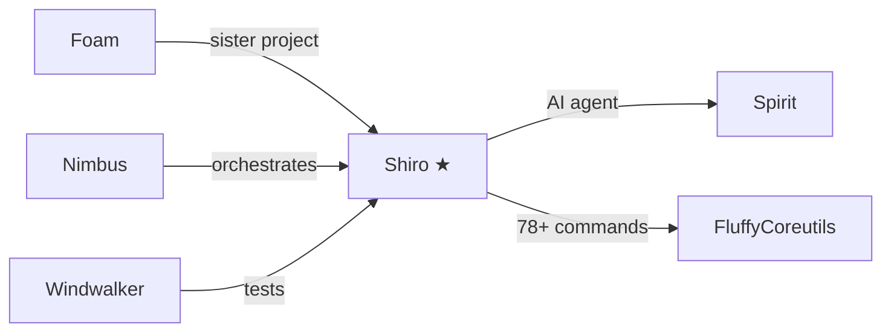

# Shiro - Browser-Native Development Environment

A complete Unix-like development environment running entirely in your browser. No servers, no containers, no native dependencies. Just open a webpage and start coding.

**Live Demo:** [williamsharkey.github.io/shiro](https://williamsharkey.github.io/shiro)

## What Can You Actually Do?

```bash
# Clone a real GitHub repo
git clone https://github.com/lodash/lodash

# Install npm packages (real tarballs from registry.npmjs.org)
npm install prettier typescript lodash

# Run CLI tools directly
prettier --write src/*.js
tsc --version

# Edit files with real editors
vi src/index.ts
nano README.md

# Build TypeScript projects
build src/main.ts --outfile=dist/bundle.js --bundle --minify

# Run tests with Jest-like syntax
test

# Full shell scripting
for f in *.ts; do echo "Processing $f"; done
```

All of this runs **in your browser tab**. No backend. No WebSocket tunnels. Pure JavaScript + IndexedDB.

## Feature Highlights

### 78+ Unix Commands
Full implementations of `ls`, `cat`, `grep`, `sed`, `find`, `diff`, `sort`, `uniq`, `wc`, `tr`, `cut`, `xargs`, `tee`, `head`, `tail`, `touch`, `cp`, `mv`, `rm`, `mkdir`, `chmod`, `ln`, and dozens more via [fluffycoreutils](https://github.com/williamsharkey/fluffycoreutils).

### Real npm Package Manager
- Downloads actual tarballs from `registry.npmjs.org`
- Resolves dependency trees with semver
- Creates `node_modules/.bin/` symlinks
- **Run CLI tools**: `prettier`, `typescript`, `eslint`, etc.

### Interactive Text Editors
- **vi**: Full modal editing (hjkl, insert/command modes, :w/:q/:wq, search with /)
- **nano**: Simple editor (Ctrl+O save, Ctrl+X exit, Ctrl+K cut, Ctrl+W search)
- Both use terminal raw mode for real keystroke handling

### TypeScript Bundler
Built-in `build` command powered by esbuild-wasm:
```bash
build src/index.ts --outfile=dist/bundle.js --bundle --minify --sourcemap
```
Compiles TypeScript, bundles dependencies, tree-shakes, minifies—all in-browser.

### Git Version Control
Full git workflow via isomorphic-git:
```bash
git init
git clone https://github.com/user/repo
git add . && git commit -m "feat: amazing feature"
git log --oneline
git diff HEAD~1
git branch feature && git checkout feature
```

### Built-in Test Runner
Jest-compatible syntax for testing:
```javascript
// mycode.test.js
describe('math', () => {
  it('adds numbers', () => {
    expect(1 + 1).toBe(2);
  });

  it('handles arrays', () => {
    expect([1, 2, 3]).toContain(2);
    expect([1, 2, 3]).toHaveLength(3);
  });
});
```
```bash
test              # Run all *.test.js files
test --verbose    # Show all test names
```

### Node.js Runtime
Execute JavaScript with CommonJS require():
```bash
node -e "console.log(require('lodash').uniq([1,1,2]))"
node script.js
```
Built-in shims for `fs`, `path`, `process`, `Buffer`, `child_process`, `crypto`, `events`, and more.

### Claude Code Integration (Spirit)
AI coding agent that can read/write files, run commands, and build projects:
```bash
spirit "create a React component that fetches user data"
```

### Persistent Filesystem
IndexedDB-backed virtual filesystem that survives page reloads. Your files, git history, and node_modules are always there.

## Self-Compilation

Shiro can clone its own repository, make changes, and recompile itself:
```bash
git clone https://github.com/williamsharkey/shiro /tmp/shiro-dev
cd /tmp/shiro-dev
vi src/commands/mycommand.ts  # Add your feature
build src/main.ts --outfile=dist/bundle.js --bundle
# Refresh page to load new bundle (IndexedDB state preserved)
```

## Architecture

```mermaid
flowchart TB
    subgraph Browser["Browser Tab"]
        subgraph UI["User Interface"]
            Terminal["xterm.js Terminal"]
            Spirit["Spirit (Claude Code)"]
        end

        subgraph Shell["Shell Layer"]
            Pipes["Pipes: cmd1 | cmd2"]
            Redirects["Redirects: >, >>, <"]
            Variables["Variables: $VAR, $?"]
            Control["Control: if/for/while"]
            PATH["PATH Resolution"]
        end

        subgraph Commands["Command Layer (78+ commands)"]
            Coreutils["Coreutils\nls, grep, sed, find"]
            DevTools["Dev Tools\ngit, npm, node, test"]
            Editors["Editors\nvi, nano"]
            Build["Build\nesbuild-wasm"]
        end

        subgraph VFS["Virtual Filesystem (IndexedDB)"]
            POSIX["POSIX API: stat, readdir, readFile"]
            Persist["Persistent across reloads"]
            Dirs["/home/user, /tmp, /node_modules"]
        end

        Terminal --> Shell
        Spirit --> Shell
        Shell --> Commands
        Commands --> VFS
    end
```



## Quick Start

**Online:** Just visit [williamsharkey.github.io/shiro](https://williamsharkey.github.io/shiro)

**Local Development:**
```bash
git clone https://github.com/williamsharkey/shiro
cd shiro
npm install
npm run dev    # Dev server at localhost:5173
```

**Build Static Site:**
```bash
npm run build  # Creates dist/ folder
# Open dist/index.html or deploy anywhere
```

## Command Reference

| Category | Commands |
|----------|----------|
| **Files** | `ls`, `cat`, `head`, `tail`, `touch`, `cp`, `mv`, `rm`, `mkdir`, `rmdir`, `find`, `ln`, `chmod` |
| **Text** | `grep`, `sed`, `sort`, `uniq`, `wc`, `tr`, `cut`, `diff`, `tee`, `xargs`, `awk` |
| **Shell** | `cd`, `pwd`, `echo`, `printf`, `env`, `export`, `source`, `which`, `test`, `[` |
| **Dev** | `git`, `npm`, `node`, `build`, `test`, `vi`, `nano` |
| **Network** | `fetch`, `curl` |
| **System** | `date`, `whoami`, `hostname`, `uname`, `sleep`, `seq`, `true`, `false` |
| **Jobs** | `jobs`, `fg`, `bg`, `wait`, `&` (background) |

## Why Shiro?

| Feature | Shiro | WebContainers | Codespaces |
|---------|-------|---------------|------------|
| No backend required | Yes | No (WASM sandbox) | No (cloud VM) |
| Works offline | Yes | Partial | No |
| File size | ~1MB | ~50MB | N/A |
| Real npm packages | Yes | Yes | Yes |
| Git support | Yes | Yes | Yes |
| AI integration | Spirit | No | Copilot |
| Self-hostable | Yes (static) | No | No |
| Open source | Yes | No | No |

## Related Projects



- [Foam](https://github.com/williamsharkey/foam) - Plain JavaScript sister project
- [Spirit](https://github.com/williamsharkey/spirit) - Claude Code agent library
- [Nimbus](https://github.com/williamsharkey/nimbus) - Multi-repo orchestration dashboard
- [Windwalker](https://github.com/williamsharkey/windwalker) - Test automation suite
- [FluffyCoreutils](https://github.com/williamsharkey/fluffycoreutils) - Shared Unix commands

## License

MIT
