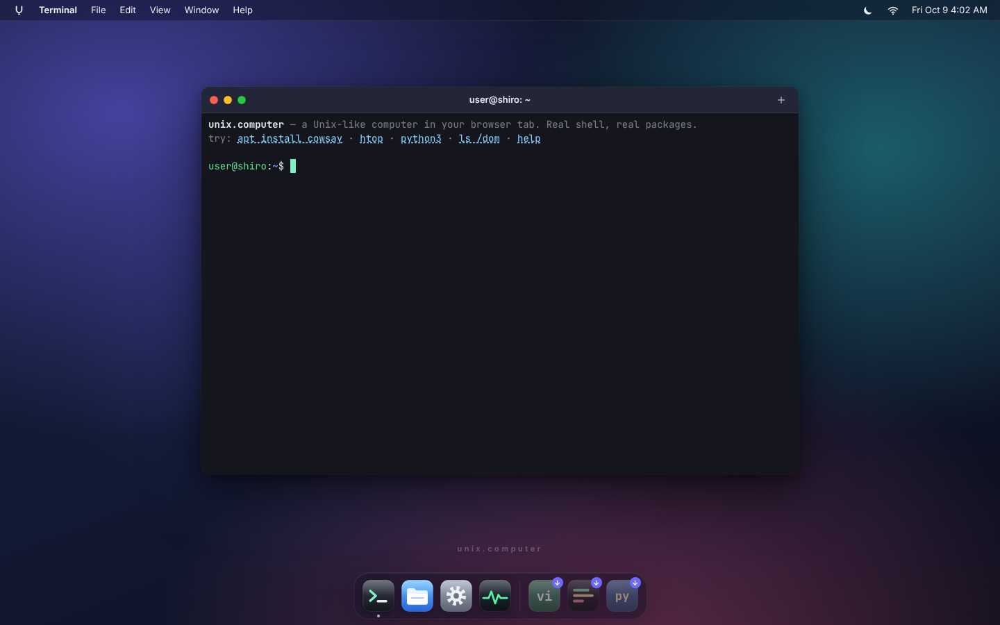
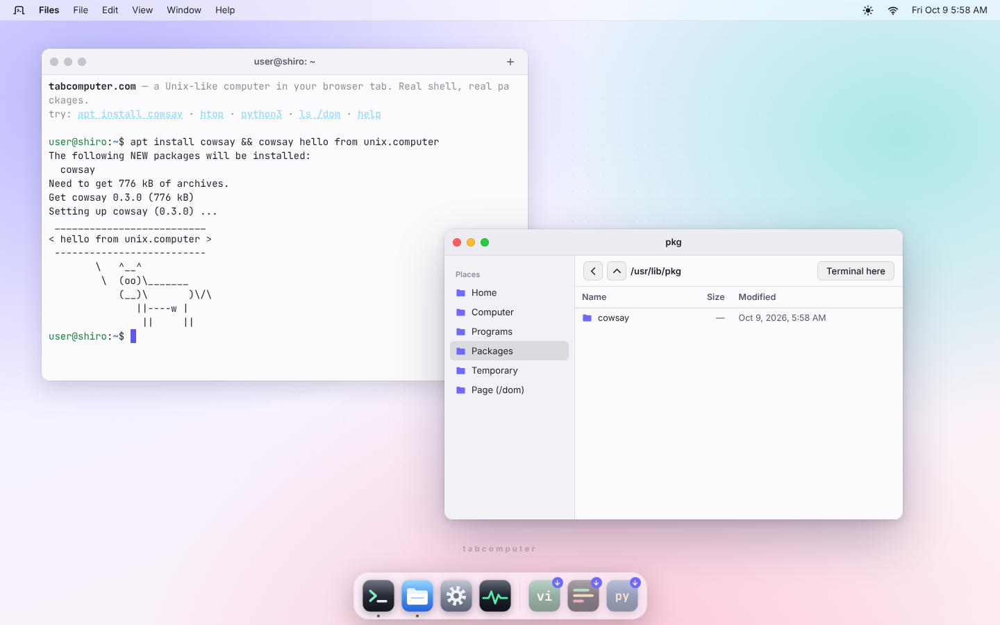
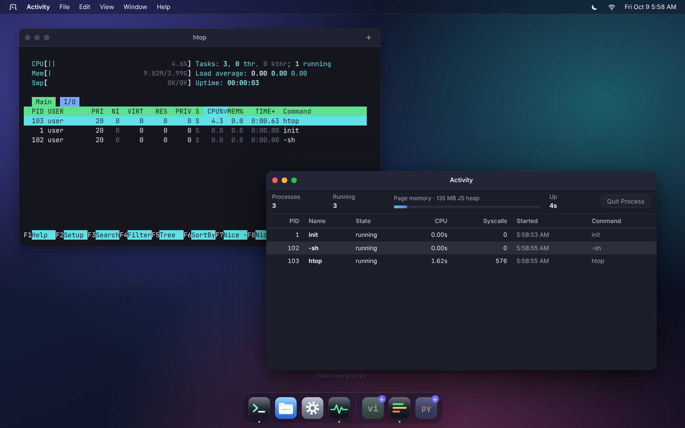
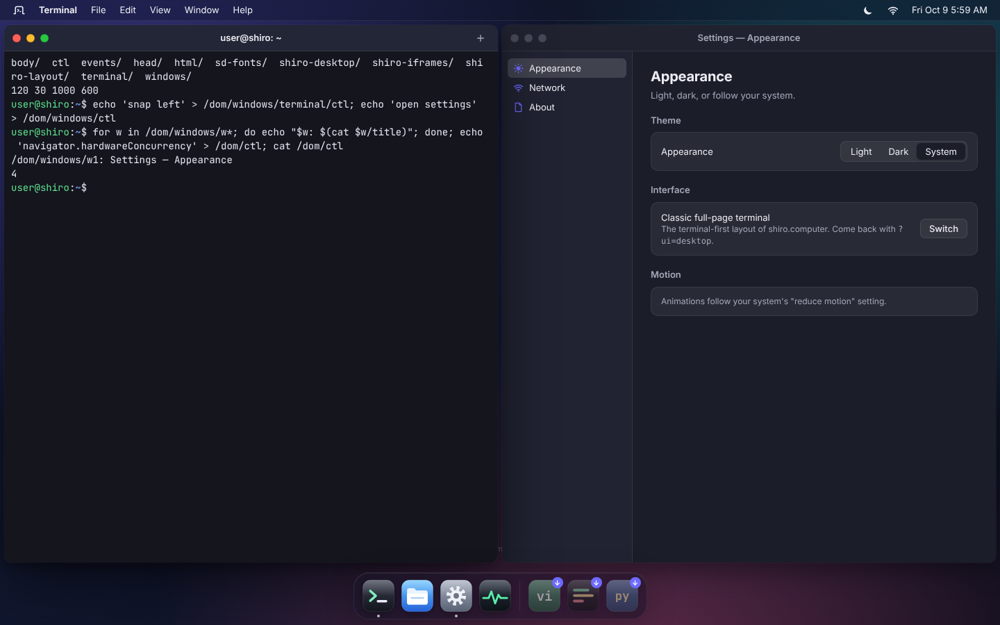
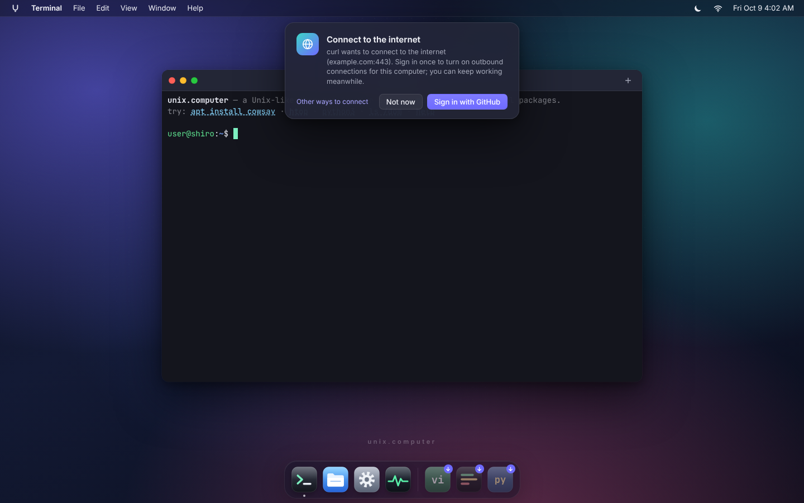
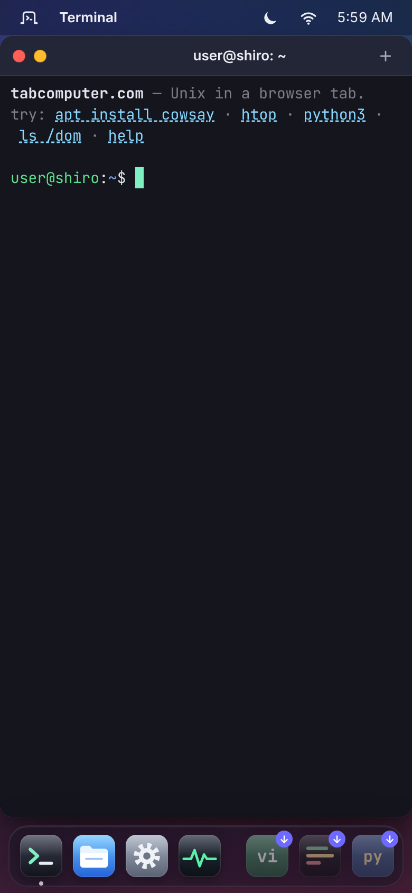
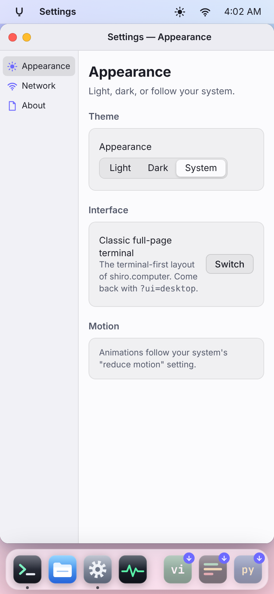

# Desktop, window manager API, and /dom

tabcomputer boots to a desktop: a menu bar, a dock, and windows. The
Terminal (the real tabcomputer terminal on a pty) opens front and center. The
full-page terminal (the `shiro` profile's UI) is still there with
`?ui=terminal`.

- Code: `src/desktop/` (window manager `wm.ts`, shell `index.ts`, Terminal
  `terminal-app.ts`, network sheet `network.ts`, lazy apps in `apps/`),
  `src/dom-fs.ts` (/dom), `src/net-signin.ts` (sign-in hook), `src/ui-mode.ts`.
- Screenshots (1440×900, and phone width at 390 px):

  | | |
  |---|---|
  |  |  |
  |  |  |
  |  |   |

## Changelog (API)

All changes are additive. Nothing below renames or removes an earlier name.

- **2026-10-09 (unix/desktop), v1.2.** Dock stacks: `AppDescriptor.group`,
  `DockGroup` (`{ id, name, order?, collapse?: 'always' | 'auto', maxLoose? }`),
  and optional `registerGroup(group)` / `groups()` on `DesktopAPI` (check
  for them before calling, as with any addition). Apps with `order` ≥ 60 and
  no `group` go in the `debian` stack.
- **2026-10-09 (unix/desktop), v1.1.** Quarters: `WindowState` gains
  `'snapped-top-left' | 'snapped-top-right' | 'snapped-bottom-left' |
  'snapped-bottom-right'` (every snapped state still starts with `snapped-`),
  and `snap()` takes `SnapSide` (`'left' | 'right' | 'top-left' | 'top-right' |
  'bottom-left' | 'bottom-right'`). `snapZone(px, py, w, h)` is exported.
- **2026-10-09 (unix/desktop), v1.** First version: `DesktopAPI`,
  `DesktopWindow`, `Surface`, content kinds `dom`, `iframe`, `terminal`,
  `surface`, apps, desktop events, `/dom`, `requireNetworkSignIn`.

## Name

The Unix edition is **tabcomputer** (tabcomputer.com). The name, domain, tagline
and description are the tabcomputer profile's `brand`
(`profiles/tabcomputer/profile.json`, [PROFILES.md](PROFILES.md)): the desktop
reads it (`src/brand.ts`: tab title, wallpaper wordmark, welcome banner, About),
and `server.mjs` (`brandAppShell`) gives the shared `index.html` that title plus
description and Open Graph tags for every host whose profile has a brand (not
shiro.computer), since link previews don't run JS.

## Choosing the UI

`uiMode()` (src/ui-mode.ts):

| condition | UI |
|---|---|
| `?ui=desktop` / `?ui=terminal` | that one, remembered in localStorage `tabcomputer-ui` |
| `?demo=1`, embedded in another page (seeds), app ("become") mode | terminal |
| saved `tabcomputer-ui` | that one |
| host `shiro.computer` or `*.shiro.computer` | terminal |
| anything else (tabcomputer.com, localhost) | desktop |

From a shell: `desktop` switches to the desktop and `desktop classic` switches
back. System menu → Classic Terminal does the same. Both modes keep
`window.__tabcomputer.terminal`. On the desktop, that terminal is the first
Terminal window's first tab. Closing that tab parks the terminal (it is not
destroyed), and the next Terminal window adopts it again.

## Using it

- **Windows** have traffic lights (close, minimize, zoom). Drag a window by its
  title bar. Drag it to the left or right edge to tile it, or to the top edge
  to maximize. Double-click the title bar to zoom. Drag any edge or corner to
  resize.
- **The dock** shows Terminal, Files, Browser, Settings and Activity, then terminal
  programs: Vim, htop and Python, plus Neovim, Emacs, nano, tmux, Lua and
  SQLite once they are installed. A program that is not installed has a ↓
  badge; clicking it runs `apt install NAME && NAME` in a new Terminal
  window. A dot under an icon marks a running app. Right-click an icon to
  list its windows, open a new window, or close it.
- **Browser** (docs/BROWSER.md): tabs, address bar, back/forward/reload,
  history, bookmarks and saved passwords, showing real sites on per-site
  browse origins with TLS done in the page. "Open in real tab" (and a banner
  for passkeys, Google sign-in and TLS 1.2-only sites) hands a page to the
  host browser. `desktop open browser` / `openApp('browser', { url })`.
- **Keyboard.** The browser keeps Ctrl/Cmd+N, T and W for itself, so desktop
  shortcuts use Alt+Shift. Terminal programs rarely use that combination.

  | keys | action |
  |---|---|
  | Alt+Shift+Enter | new Terminal window |
  | Alt+Shift+T | new tab (in a Terminal window) |
  | Alt+Shift+W | close window |
  | Alt+Shift+M | minimize |
  | Alt+Shift+↑ / ↓ | zoom / restore (or minimize) |
  | Alt+Shift+← / → | tile left / right |
  | Alt+\` (Alt+Shift+\`) | cycle windows |
  | Ctrl+Alt+U / I / J / K | top-left / top-right / bottom-left / bottom-right quarter |
  | Ctrl+Space (Cmd+Space, Alt+Shift+Space) | search: apps, commands, recent commands, files |
  | Alt+Shift+F / Alt+Shift+, | Files / Settings |
  | Cmd+N / Cmd+W / Cmd+\` | new terminal / close / cycle, when the browser passes them on (installed app, fullscreen) |

- **Snapping**: drag a title bar to the left/right edge for a half, to an
  edge within 64 px of a corner for that quarter, to the top for maximized.
- **Search** (Ctrl+Space or the magnifier in the menu bar, `spotlight.ts`,
  loaded on first use): fuzzy matching over apps, builtins and programs on
  PATH, the last 200 lines of `~/.bash_history`, and up to 3000 files under
  `/home/user` (4 levels, skipping `node_modules`, `.git`, caches). Enter
  opens an app or file, or runs the command in a new Terminal window; the
  last entry always runs what you typed. Ctrl+Space no longer reaches the
  terminal (Ctrl+@ still sends NUL, e.g. for Emacs' set-mark).
- **Layout after a reload** (`session.ts`): Terminal (its working
  directory), Files (its folder), Settings (its pane), Activity and About
  windows come back where they were, maximized/snapped/minimized as they
  were (localStorage `tabcomputer-desktop-session`). The main terminal gets its
  geometry at boot; the others reopen once the page is idle. Program windows
  (Vim, htop, X11 apps) are not reopened: that would run them again.
- **First visit**: three short cards in the corner (what this is, real Linux
  programs and `debian install`, where files live), shown once per browser
  (localStorage `tabcomputer-desktop-tour`); Help → Welcome Tour shows them again.
- **About This Computer** lists measured status with the document that
  records each number (`STATUS` in `apps/about.ts`: keep it in step with
  DEBIAN_SCORE.md and CONFORMANCE.md), and what is real, emulated and absent.

- **Themes**: light, dark, or match the system (View menu, the sun/moon icon
  in the menu bar, or Settings → Appearance). Saved in localStorage
  `tabcomputer-desktop-theme`. Terminals switch palettes with the theme.
- **Motion**: every animation and transition turns off under
  `prefers-reduced-motion: reduce`.
- **Phone width** (≤ 640 px): every window fills the work area. Menus collapse
  to the app name, the menu bar is solid (its color is the page's
  `theme-color`, set with the theme) and drops the clock. The network icon is
  a globe with a status dot: blue online, green signed in, amber sign-in
  needed, gray offline.
- **Touch devices** (`pointer: coarse`, `mobile.ts`, its own chunk): the
  desktop follows `visualViewport`, so when the on-screen keyboard opens the
  dock hides and windows shrink to the space above it, with the cursor line
  kept in view; the change crossfades over 0.3 s (instant with reduced
  motion). An extra-keys bar sits at the bottom: Esc, Tab, Ctrl, Alt, `|`,
  `~`, `` ` ``, arrows, paste, `/ - $ & ;`. Ctrl and Alt are one-shot and also
  apply to the next letter typed on the phone's keyboard. The keyboard button
  in the menu bar turns the bar on or off; Settings → Appearance → Extra keys
  picks Off, Auto (hidden while the phone's keyboard is open) or Always
  (localStorage `tabcomputer-keybar`). The classic UI keeps `src/mobile-input.ts`.
- **Dock stacks**: when the dock would not fit (phones), Settings and
  Activity share a System stack and Vim, Python and installed programs a
  Programs stack; Terminal, Files and htop stay loose. Debian GUI apps stack
  once there are more than four, at any width. Tap a stack to open it.
- **Fonts** are self-hosted: Inter and JetBrains Mono (latin, variable,
  `public/fonts/`, SIL OFL, license files next to them). Only the desktop
  loads them.

## Loading: one draw

The first frame of the desktop is its final layout; nothing in the menu bar,
dock or windows moves afterwards unless the user acts.

- `bootDesktop` builds the desktop hidden (`.sd-booting`: `visibility:
  hidden`, transitions and animations off). The page shows its background
  and, on branded profiles, the boot mark (server.mjs inlines the brand's
  SVG favicon as `#boot-mark`; light or dark from the system's scheme).
- It appears in one frame once everything that would change the layout has
  settled: the Inter and JetBrains Mono fonts (preloaded by main.ts as soon
  as the desktop is chosen; `font-display: block`; if the terminal was
  measured before JetBrains Mono arrived it is re-measured first), the
  installed packages (dock badges, optional programs), the Debian GUI apps
  (`registerGuiApps` resolves once installed apps are registered), the phone
  layer (`mobile.ts`) and last session's windows (opened without their
  animation; the main terminal keeps focus). Anything that takes longer than
  1.5 s (`REVEAL_CAP_MS`) no longer holds it up.
- `Desktop.holdReveal(promise)` adds a wait (main.ts uses it for the GUI
  apps). The mark `shiro:desktop:revealed` records when it appeared.
- Dock hover magnifies with `transform` only: each icon keeps its slot, so
  neighbours never move.
- `tests/browser/no-reflow.mjs` checks it in Chromium at desktop and iPhone
  sizes, light and dark: cumulative layout shift 0, every menu bar, dock and
  window element's rect the same from the first visible frame to the
  settled page, and no neighbour moving while each dock icon is hovered.
  `--shots` writes screencast strips (docs/screenshots/load-frames-*.png).

## Window manager API

The page exposes it as `window.__tabcomputer.desktop` and `globalThis.__shiroDesktop`.
Code in this repo can call `getDesktop()` from `src/desktop/wm.ts` instead.
Both are `null` or `undefined` in the classic UI. The types live in `wm.ts`.

```ts
interface DesktopAPI {
  readonly version: number;                      // 1
  createWindow(opts: WindowOptions): DesktopWindow;
  windows(): DesktopWindow[];                    // bottom to top
  get(id: string): DesktopWindow | undefined;
  focused(): DesktopWindow | null;
  workArea(): Geometry;                          // page px between the menu bar and the dock
  registerContentKind(kind: string, factory: ContentFactory): void;
  registerApp(app: AppDescriptor): void;         // dock + `desktop open ID` + /dom/windows/ctl
  apps(): AppDescriptor[];
  openApp(id: string, args?: Record<string, unknown>): Promise<DesktopWindow | null>;
  theme(): 'light' | 'dark';
  setTheme(pref: 'light' | 'dark' | 'system'): void;
  on(ev: 'window-created' | 'window-closed' | 'window-changed' | 'focus-changed' | 'apps-changed' | 'theme-changed',
     cb: (win?: DesktopWindow) => void): () => void;
}
```

### WindowOptions

| option | meaning |
|---|---|
| `id` | stable id (`[A-Za-z0-9_-]+`, unique), else `w1`, `w2`, … It names `/dom/windows/<id>`. |
| `title`, `appId`, `icon` | `appId` groups windows under a dock icon. `icon` (inline SVG or URL) is used when the app has none. |
| `content` | `{kind:'dom', element?}`, `{kind:'iframe', src? \| srcdoc?, sandbox?, allow?}`, `{kind:'terminal', command?, cwd?}`, `{kind:'surface', ...SurfaceOptions}`, or a registered kind |
| `width`, `height` | client area size in CSS px (the title bar adds 38 px) |
| `x`, `y` | frame position in work-area coordinates. Without them, the window is centered and cascaded. |
| `minWidth`, `minHeight`, `resizable` | defaults 220, 120, `true` |
| `decorations` | `'server'` (default: title bar, lights, resize edges) or `'none'` (the client draws its own; see `beginMove`/`beginResize`) |
| `override` | override-redirect, for X11 menus, tooltips and DnD icons: no frame, never focused, not in the dock, placed exactly, above normal windows |
| `transientFor` | parent window id (dialogs): kept above the parent, closed with it |
| `alwaysOnTop`, `skipTaskbar` | layer above normal windows; leave out of dock and cycling |
| `state` | `'normal'`, `'maximized'` or `'minimized'` at creation |
| `focus` | take focus on creation (default `true`, `false` for override windows) |
| `onClose(win)` | runs before closing; returning `false` keeps the window open |

### DesktopWindow

```ts
interface DesktopWindow {
  readonly id: string; readonly appId?: string; readonly kind: string;
  readonly element: HTMLElement;      // frame
  readonly body: HTMLElement;         // client area
  readonly titlebarExtra: HTMLElement | null;   // put title-bar buttons here
  readonly options: Readonly<WindowOptions>;
  title: string; readonly state: 'normal' | 'minimized' | 'maximized' | 'snapped-left' | 'snapped-right'
    | 'snapped-top-left' | 'snapped-top-right' | 'snapped-bottom-left' | 'snapped-bottom-right' | 'closed';
  readonly focused: boolean;
  readonly iframe?: HTMLIFrameElement; readonly surface?: Surface; readonly content?: unknown;
  setTitle(t): void; geometry(): Geometry;      // {x, y} of the frame, {width, height} of the client area
  move(x, y): void; resize(w, h): void; setGeometry(partial): void;
  focus(): void; minimize(): void; restore(): void; maximize(): void; zoom(): void; snap(side: SnapSide): void;   // halves and quarters
  close(force?): boolean;                        // false when onClose vetoed it
  beginMove(ev: PointerEvent): void;             // client-side decorations start a move...
  beginResize(ev: PointerEvent, edges: string): void;   // ...or a resize ('n','se','w',...)
  setAttention(on: boolean): void;
  on('close' | 'focus' | 'blur' | 'move' | 'resize' | 'state' | 'title', cb): () => void;
}
```

`move`/`resize` on a maximized or tiled window first return it to normal.
Geometry changes fire `move`/`resize` on the window and `window-changed` on
the desktop.

### Surfaces: native GUI clients (unix/gui)

A display server (X11 or Wayland on unix/gui) maps each toplevel to
`createWindow({ content: { kind: 'surface', ... } })` and talks to its
`Surface`:

```ts
interface SurfaceOptions { bufferWidth?; bufferHeight?; scale?; cursor?; autoResize? /* default true */ }
interface Surface {
  readonly canvas: HTMLCanvasElement;            // or transferControlToOffscreen() it to a worker
  readonly width: number; readonly height: number; readonly scale: number;   // buffer, device px
  present(src: CanvasImageSource | ImageData, dx?, dy?): void;   // a frame or a damaged rect
  setBufferSize(w, h, resizeWindow?: boolean): void;   // client-initiated resize
  setCursor(css: string): void;
  onInput(cb: (ev: SurfaceInputEvent) => void): () => void;
  onConfigure(cb: (w, h, scale) => void): () => void;  // like xdg_toplevel.configure
}
interface SurfaceInputEvent {
  type: 'pointerdown' | 'pointerup' | 'pointermove' | 'wheel' | 'keydown' | 'keyup' | 'enter' | 'leave' | 'focus' | 'blur';
  x; y;                 // buffer (device-pixel) coordinates
  button; buttons; deltaX; deltaY;   // wheel deltas in px
  key; code; keyCode; repeat; shift; ctrl; alt; meta; time;
}
```

Mapping notes:

- **Toplevels** are decorated by the desktop (server-side decorations).
  `_NET_WM_NAME` or `xdg_toplevel.set_title` → `setTitle`. Minimize, maximize
  and close requests → `minimize()`, `maximize()`, `close()`. The close
  button fires the window's `close` event: send `WM_DELETE_WINDOW` or
  `xdg_toplevel.close` from it, and use `onClose` returning `false` to let the
  client decide.
- **Override-redirect windows and popups** (menus, tooltips) use
  `override: true` with exact `x`, `y` in work-area coordinates, relative to
  the parent's `geometry()`. Transient dialogs use `transientFor`.
- **Client-side decorations** (GTK headerbars) use `decorations: 'none'` and
  call `beginMove(ev)` / `beginResize(ev, edges)` from the pointerdown that
  `xdg_toplevel.move`/`resize` answers.
- **Resizing**: with `autoResize` (default), the canvas buffer follows the
  window and keeps its pixels, and `onConfigure` reports the new size. The
  client then redraws. With `autoResize: false`, the buffer only changes when
  the client calls `setBufferSize`.
- **Keyboard**: the canvas takes focus with the window. Keys are
  `preventDefault`ed, except the desktop's shortcuts (`isDesktopShortcut`).

A canvas client takes about 15 lines:

```js
const d = window.__tabcomputer.desktop;
const w = d.createWindow({ title: 'xeyes', appId: 'x11', width: 300, height: 200, content: { kind: 'surface' } });
const ctx = w.surface.canvas.getContext('2d');
const draw = (mx = 0, my = 0) => { ctx.fillStyle = '#fff'; ctx.fillRect(0, 0, w.surface.width, w.surface.height);
  ctx.fillStyle = '#000'; ctx.beginPath(); ctx.arc(mx, my, 10 * w.surface.scale, 0, 7); ctx.fill(); };
w.surface.onInput(e => e.type === 'pointermove' && draw(e.x, e.y));
w.surface.onConfigure(() => draw());
w.on('close', () => console.log('client gone'));
draw();
```

### Content kinds and apps

`registerContentKind(kind, (win, content, body) => instance)` adds a kind.
The factory fills `body`, and its return value becomes `win.content`. The
desktop registers `terminal`; the WM itself provides `dom`, `iframe` and
`surface`.

`registerApp({ id, name, icon, order, dock, launch(args), menus() })` puts an
app in the dock (if `dock` is not `false`), in `desktop open ID` and in
`/dom/windows/ctl` (`open ID`). `menus()` adds menu-bar menus while the app
has focus. Apps with `order` ≥ 20 sit after the dock's separator.

`registerGroup({ id, name, order, collapse, maxLoose })` (v1.2, optional on
`DesktopAPI`) declares a dock stack; apps join it with `group: id`. A
stack with `collapse: 'always'` is always one tile; `'auto'` (default)
stacks when the dock is crowded or the group has more than `maxLoose`
(default 4) apps. The desktop registers `system`, `programs` and `debian`
(`maxLoose: 4`; apps with `order` ≥ 60 and no `group` go there). `groups()`
lists them by `order`.

## Network sign-in

The desktop is never gated behind a login. When something needs outbound
network that requires a signed-in user, it calls the single hook:

```ts
import { requireNetworkSignIn } from './net-signin';   // or globalThis.__shiroRequireNetwork
const token = await requireNetworkSignIn({ host: 'example.com', port: 443, reason: 'curl wants to connect' });
if (!token) return -ENETUNREACH;   // the user said "Not now"
```

- **With a saved sign-in**, the hook resolves at once and later visits
  connect silently. The saved sign-in is the GitHub token in localStorage
  `tabcomputer_github_token`, the same one `gh auth login` saves.
- **Without one**, the desktop shows a non-blocking sheet under the menu bar:
  "Connect to the internet — Sign in with GitHub", plus a small "Other ways to
  connect" link (a placeholder for now). Sign-in uses GitHub's device flow
  (`src/github-auth.ts`), and the sheet shows the code with Copy and Open
  GitHub buttons. Concurrent callers share one sheet. After "Not now", the
  hook returns `null` for 60 s instead of asking again.
- **In the classic UI** no handler is registered, so the hook returns `null`
  (or the saved token).
- **Same-origin requests never call it.** That covers package downloads, the
  npm registry proxy and `/api/*`. `needsSignIn(url)` tells them apart.

Today the hook has one caller: the TCP relay token request (`relayToken` in
`src/kernel/net.ts`). That request sends `Authorization: Bearer <token>` when
a sign-in is saved, and asks the hook when the server answers 401.

The server enforces sign-in only when `TABCOMPUTER_TCP_REQUIRE_SIGNIN=1` is set.
`POST /tcp/token` then needs a GitHub token that `api.github.com/user`
accepts (checks are cached for 10 minutes); without one it answers
`401 {"error":"signin_required","provider":"github"}`. When the variable is
unset, nothing changes.

**Use my own connection.** Settings → Network → Connection switches the
kernel's sockets from this site's relay to one the user runs: a `ws(s)://`
relay URL and, if that relay issues tokens, its token URL (any relay speaking
docs/NETWORKING.md's protocol; `TABCOMPUTER_TCP_RELAY=1 node server.mjs` with this
site in `TABCOMPUTER_TCP_ORIGINS`). **Test** checks the relay (the token request,
then a WebSocket open) before it is saved. The choice lives in localStorage
`tabcomputer_relay` (`ownRelay`/`setOwnRelay`/`relayNetConfig` in net-signin.ts), and
the desktop applies it with `netStackOf(kernel).configure(...)` at boot and on
change. A user's relay gets `credentials: false` (a NetConfig field, default
true): the saved GitHub token is never sent to it, and a 401 from it doesn't
open the sign-in sheet. The sheet's "Other ways to connect" links here. The
classic UI never sets a relay of its own, so shiro.computer is unaffected.

The menu bar's network icon shows `online`, `signed-in`, `needs-sign-in`,
`offline` or `unavailable` (relay off). Clicking it opens a popover with Sign
in / Sign out. Settings → Network shows the same, plus a relay check.

## /dom: the page as files

`/dom` is mounted on the filesystem (a FileSystem virtual provider, so every
builtin sees it) and its event streams are kernel devices (so a blocking
`read(2)` from a WASM or x86 program waits for the next event). Reads and
writes happen synchronously against the live DOM. A trailing newline on
writes is dropped, so `echo` works.

```
/dom/ctl                     write JS to evaluate it; read the last result (JSON for non-strings)
/dom/<id-or-selector>/       the element with that id, else the first match of the CSS selector
    text html outerhtml      textContent / innerHTML (rw), outerHTML (r)
    value                    form value (rw; writing fires input + change)
    tag rect count           tag name, "x y w h", number of matches
    click                    write anything to click it
    attr/<name>              attribute (rw; writing a new name creates it)
    style/<prop>             inline value, else computed (rw; empty write removes)
    children/<n>/…           walk down the tree
    <n>/…                    the nth match of the selector
/dom/events/<type>           one line per event: type t=ms target=tag#id.class key=value…
/dom/windows/ctl             "open <app>" (read: the apps you can open)
/dom/windows/<id>/           desktop windows
    title                    rw
    geometry                 "x y width height" (rw)
    state app kind focused   r
    ctl                      close | move X Y | resize W H | focus | minimize | maximize | zoom | restore | snap left|right | title TEXT
```

Selectors can't contain `/`. URL-encode it as `%2F` (any `%XX` in a
component is decoded). Quote selectors with spaces or `>` for the shell.

**Event streams.** Kernel processes and `cat` at a terminal follow
`/dom/events/<type>` live until Ctrl-C. Other in-page builtins (`grep`,
`cat` into a pipe) get the most recent events (up to 200). Recording for a
type starts the first time anyone looks at it. `window` events are the
desktop's: `window-created`, `window-closed`, `focus-changed` and
`window-changed`. Password fields report `value="(hidden)"`.

Examples:

```sh
ls /dom                                   # ctl events windows html head body, plus element ids
cat /dom/windows/terminal/title           # user@tabcomputer: ~
echo 'move 40 40' > /dom/windows/terminal/ctl
echo 'snap left'  > /dom/windows/terminal/ctl
echo '0 0 900 500' > /dom/windows/terminal/geometry
echo 'open files' > /dom/windows/ctl
for w in /dom/windows/w*; do echo "$w: $(cat $w/title)"; done
cat '/dom/.sd-mb-app/text'                # the focused app's name in the menu bar
echo 'Hello' > '/dom/.sd-wordmark/text'
echo 'document.title' > /dom/ctl; cat /dom/ctl
echo 'navigator.hardwareConcurrency * 2' > /dom/ctl; cat /dom/ctl
cat /dom/events/click                     # live, Ctrl-C to stop
cat /dom/events/window                    # window manager events
grep -c keydown /dom/events/keydown       # recent ones
echo 'red' > /dom/body/style/outline-color
cat /dom/body/children/0/tag
```

Errors come back as errno. A JS exception in `ctl` is EIO, with the
exception message in the shell's error. A bad ctl command is EINVAL, writing
a read-only file is EACCES, and a missing element is ENOENT.

Tests: `tests/tests/shiro-vitest/dom-fs.test.ts`, `desktop-wm.test.ts`.
