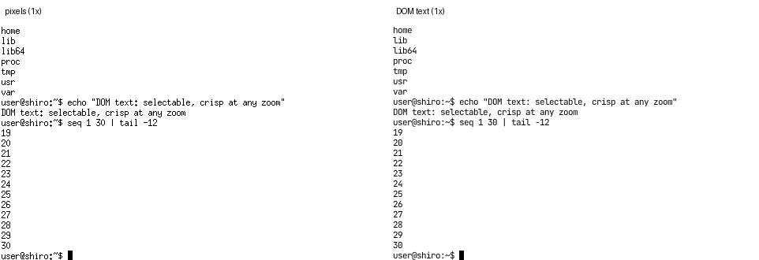
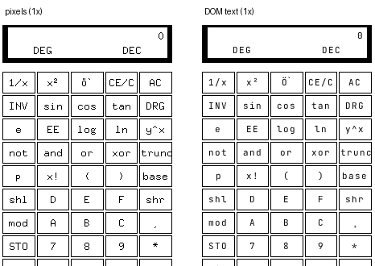
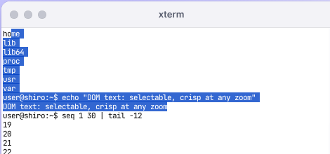
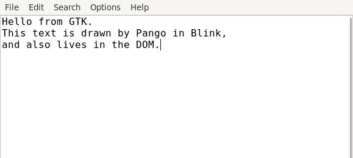
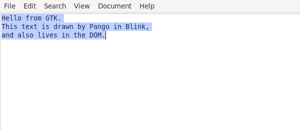

# DOM rendering for native apps (design note)

Question: can unmodified Linux GUI apps render to **DOM nodes** instead of
pixels, without knowing it? Real text in the page would be sharp at any zoom
or pixel density, selectable and copyable, findable with Ctrl+F, and readable
by screen readers, which a canvas is not.

Short answer: **for text, yes, for Xlib/Xaw-era apps through the X
protocol, and for GTK 2/3 apps through a preloaded hook** (both below).
Modern toolkits never send text to the X server: they rasterize it
client-side and send pixels. For them the semantics have to be taken from
inside the client, here from Pango and cairo, or from the accessibility
tree.

## The prototype: core X text as ``s

The X11 core protocol's text requests carry the actual characters:
`ImageText8/16` and `PolyText8/16` name a font, a position and the string.
Xshiro (`src/x11/`) can therefore turn them into DOM text instead of glyphs.

- **Server** (`server.ts`): with `domText` on, text drawn on a window is not
  rasterized (ImageText still paints its background rectangle), and each run
  is reported through `hooks.text` as `{x, y, width, ascent, descent, text,
  font, fg, bg}` in toplevel coordinates. 8-bit fonts map codes as ISO
  8859-1 and 16-bit fonts as ISO 10646, so the code is the code point.
  `CopyArea` within a window (how terminals scroll) is reported as
  `hooks.copy` begin/end.
- **Text layer** (`dom-text.ts`): one absolutely positioned layer per
  toplevel, over its canvas. A run becomes a `` with the X position,
  a CSS font derived from the XLFD (spacing `c`/`m` → monospace, weight,
  slant; size from ascent + descent), `letter-spacing` fitted so the span is
  exactly as wide as the X text, and the GC's foreground colour.
  The layer keeps the spans consistent with the pixels:
  - drawing over a span's area removes it. Runs in fixed cells are *cut* at
    cell boundaries, so redrawing one cell (a cursor) keeps the rest of the
    line;
  - CopyArea moves the spans it carries, so scrolled lines move instead of
    disappearing;
  - a run that continues another on the same baseline (terminals draw each
    typed character, and skip blank cells) is merged into it, with spaces
    for the skipped cells. A line becomes one span and copies with its words
    and spaces; each span ends in a newline, so copied text keeps its lines.
- **Selection**: clicks belong to the X app, so the layer ignores the
  pointer except while **Alt** is held. Then a drag selects text, and Ctrl+C
  copies it. Two details were needed: stopping the window frame's
  pointerdown and focusin handlers, which move focus to the canvas and
  cancel the selection being started.
- **Modes**: `xserver text pixels|dom|overlay`, `?xtext=dom|overlay` in the
  page URL, or localStorage `shiro-x-dom-text`. `overlay` keeps the glyph
  pixels and makes the spans transparent (the PDF.js text-layer model):
  pixel-exact, still selectable, findable and accessible. In DOM modes xterm
  keeps its core fonts even on HiDPI screens instead of switching to Xft
  (see GUI.md, "HiDPI"), since spans are sharp at any scale.

Tests: `x11.test.ts` "DOM-text mode reports core text instead of drawing
glyphs, and CopyArea moves" (protocol level: runs, colours, fonts, no glyph
pixels, copy events).

### Results in Chromium

xterm (bash, `ls /`, an `echo`, `seq 1 30 | tail -12`), xcalc, and a
digital xclock:

| | pixels | DOM text |
|---|---|---|
| xterm | glyphs | 23 spans: one per line (merged runs), scrolling moves them |
| xcalc | glyphs | 58 spans: every key label and the display |
| xclock -digital | glyphs | 1 span, updated every second |
| Accessibility tree (Playwright snapshot) | only the window titles | xterm's lines as text nodes (`user@shiro:~$ echo "DOM text: …"`, the output, …) |
| Alt + drag, copy | — | `home\nlib\nlib64\nproc\ntmp\nusr\nvar\nuser@shiro:~$ echo "DOM text: selectable, crisp at any zoom"\n…` |

`dom-text-xterm-2x.png` shows a 2× screen. There xterm in pixel mode uses
an outline Xft font (HiDPI change); in DOM mode the core font stays and the
browser draws the spans at device resolution.

Fidelity is close: same positions, widths (letter-spacing fitted per run)
and colours. The face differs: JetBrains Mono rather than misc-fixed's
bitmaps. Limits of this cheap version:

- Only text drawn **directly on windows**. Text drawn into a pixmap and
  copied to the window (double buffering) arrives as pixels; xterm, xcalc
  and xedit draw directly.
- Stacking isn't modelled: a span stays visible if another X window of the
  same app covers it (menus, popups), and pixels drawn with a non-copy GC
  function (XOR cursors, rubber bands) can't be mirrored in the DOM.
- Underline, strikeout and bold-by-overstrike are not mapped. Only the
  foreground colour is.
- In `dom` mode, apps reading text back with GetImage get the background
  without glyphs (no app here does).

### Which apps send text the server can see (measured)

Request census per app over its start and one full redraw (resize), on
Xshiro in Chromium. `coreText` = ImageText/PolyText, `renderGlyphs` =
RENDER CompositeGlyphs, `putImage` = client-rasterized pixels:

| App | Toolkit | coreText | renderGlyphs | putImage |
|---|---|---:|---:|---:|
| xterm | Xaw, core fonts | 78 | 0 | 3 |
| xcalc | Xaw | 182 | 0 | 2 |
| xedit | Xaw | 872 | 0 | 4 |
| xclock (analog / -digital) | Xaw + Xft | 0 | 0 | 2–6 |
| xeyes | Xt, SHAPE | 0 | 0 | 0 |
| Dillo | FLTK + Xft | 0 | 0 | 683 |
| GPicView | GTK 2 | 0 | 0 | 37 |
| L3afpad | GTK 3 | 0 | 0 | 14 |
| FeatherPad | Qt 5 | 0 | 0 | 15 |

Every modern toolkit here rasterizes text with cairo, Qt's raster engine or
Xft in the client and sends **images**: not even RENDER glyphs, which would
at least be glyph IDs. So the X wire has nothing to recover for them, and
any route to their text has to start inside the client.

## GTK 2/3: the Pango hook (implemented)

Following recommendation 2 below, GTK apps now report their text too, in
`overlay` mode: pixels unchanged, transparent spans on top.

**`libshiro-text-hook.so`** (`scripts/gui/text-hook/`, 17 KB, built with
`build.sh`; needs GLIBC 2.34, Debian 12 has 2.36) is loaded with
`LD_PRELOAD` into GTK apps by the installer's launcher when the text mode
isn't `pixels` (`src/gui/apps.ts`, copied to
`/usr/lib/shiro/libshiro-text-hook.so`). Every function it calls is looked
up with `dlsym`, so one build serves GTK 2 and 3. It interposes functions
that one library calls in another, which is what `LD_PRELOAD` can reach:

- `cairo_surface_has_show_text_glyphs` answers yes, so libpangocairo passes
  the UTF-8 text with its glyphs, as it does for PDF output. GTK 3 draws
  labels with `pango_cairo_show_layout` and text views with
  `pango_cairo_show_glyph_item`; both end in
- `cairo_show_text_glyphs`, which records the text, its device position
  (CTM × GTK's integer window scale), the font's ascent and descent and the
  source colour, then draws exactly as before (cairo falls back to plain
  glyphs on image and Xlib surfaces);
- GTK 2 draws most text with `gdk_draw_layout`, whose renderer passes
  glyphs only: that is interposed too, and the lines come from the
  PangoLayout (iterator extents and baseline);
- `gdk_window_begin_draw_frame`/`end_draw_frame` (GTK 3) and
  `gdk_window_begin_paint_region`/`end_paint` (GTK 2) mark the frames. When
  a frame ends, its runs are appended to the painted window's
  `_SHIRO_TEXT` property as `x baseline width ascent descent rrggbb\ttext`
  lines. They travel on the app's own X connection, after the frame's
  pixels, so the PutImage's damage clears the old spans first and the new
  ones land on top.

Xshiro consumes `_SHIRO_TEXT` instead of storing it (`server.ts`
`clientText`), offsets each run by the window's position in its toplevel,
and hands it to the same `TextLayer` with `overlay: true`. Two details made
GTK 2 work:

- spans remember the window they were drawn on, and drawing removes only
  the text of that window and its ancestors. X clips a window's drawing to
  exclude its children, and GTK 2 uses real child windows (a file
  chooser's sidebar, list header and buttons), so a parent's repaint used
  to wipe its children's text;
- GTK 2 paints child windows into the toplevel's "implicit paint" pixmap
  and copies it to the screen when the toplevel's paint ends, inside GDK
  where no interposition reaches. So runs reported by the app are applied
  on the next animation frame, after the damage of the pixels they go
  with. Overlay spans
keep their real colour for the selection highlight and hide their glyphs
with `-webkit-text-fill-color: transparent` (Chromium paints no selection
for `color: transparent` text).

Results in Chromium, `?xtext=overlay` (`tests`: x11.test.ts "takes text runs
from GTK apps"):

| App | Spans after typing three lines | Accessibility tree | Alt + drag, copy | Visual change |
|---|---|---|---|---|
| L3afpad (GTK 3) | menu bar (File … Help) + the three lines | menu items and the lines as text | exactly the three lines, with line breaks | none: a pixel diff against `pixels` mode differs only in a 3 px column (the scrollbar fading out) |
| L3afpad at 2× (GDK_SCALE=2) | same, same positions in CSS px | same | same | — |
| Mousepad (GTK 3, GtkSourceView) | menu bar + the three lines | same | same | — |
| GPicView's Open dialog (GTK 2) | all 12 labels: Places, Search, Recently Used, user, File System, Name, Size, Modified, the filter, Open, Cancel | — | — | — |

Not covered yet: text a GTK app draws outside a frame (rare), widgets
drawing with `cairo_show_text` directly (toy text API, not Pango), and
stacking (a menu's spans over a covered window still answer selection).

## Survey: where else the semantics survive

| Source | What it carries | Reach | Cost / gaps |
|---|---|---|---|
| **X core text** (done) | strings, font, colour, position | Xlib/Xaw/Motif-era apps: xterm, xedit, xcalc, xfontsel, emacs-lucid with core fonts, old xpdf | none beyond this prototype; small set of apps |
| **Pango hook** (`LD_PRELOAD`) | `pango_renderer_draw_glyph_item(renderer, text, glyph_item, x, y)` gets the **paragraph text**, the item's offset and length, glyph positions and the font description. The cairo context gives the device transform and, for xlib surfaces, the target drawable's XID | every GTK 2/3 app (L3afpad, Mousepad, Ristretto, GIMP, Inkscape, NetSurf), anything else drawing with Pango | an x86-64 `.so` built once, loaded by Blink via `LD_PRELOAD`; a side channel to the page (a kernel pipe, or an X property on the drawable); map buffer coordinates to window coordinates (GTK 3 draws into the window's own surface at window offsets). Text comes with exact layout, so `overlay` mode keeps pixels exact |
| **GTK 4 GSK render nodes** | a tree: colour, border, rounded clip, shadow, gradient, transform, opacity, texture, and **text nodes holding a PangoFont and glyph IDs, not characters** | GTK 4 apps (Debian 12: GTK 4.8, gnome-text-editor, …) | Debian's GTK 4 already has the **Broadway** backend (`gtk4-broadwayd`, `GskBroadwayRenderer`): a GSK→browser renderer that turns the tree into positioned DOM nodes with CSS, but sends text as rendered textures. Real text needs the item's characters (glyph→character needs the font's cmap, ambiguous with ligatures). Doable inside a patched renderer that walks back to the PangoLayout; that is a GTK patch, not "without knowing it" |
| **AT-SPI accessibility tree** | roles, names, states, text contents with per-character extents, actions | GTK 2/3/4 and Qt 5 (with `QT_ACCESSIBILITY=1`), when the bridge is loaded | needs a D-Bus session bus (`dbus-daemon` in Blink) plus at-spi2-registryd and the atk-bridge (we set `NO_AT_BRIDGE=1` today). It gives **semantics** (an invisible ARIA tree over the pixels for screen readers, and text for find and select), not pixels. Laggy for live text; extents are approximate |
| **Qt** | QPainter text via QFontEngine; QAccessible | Qt 5 apps | hooking C++ symbols in `libQt5Gui` is fragile; the AT-SPI route is cleaner |
| **Tk** | Tk widgets are Tcl objects; text drawn with Xft (Debian's `libtk8.6` depends on libxft2) | Tk apps, Python's tkinter | client-side pixels like the others. A DOM-native Tk would be a Tk port, not interception |
| **dialog / whiptail** | full-screen ncurses forms | shell scripts | they run in Shiro's terminal, which is already DOM text. Turning their boxes into native HTML dialogs means reimplementing `dialog`'s command line as a Shiro builtin (cheap: a few hundred lines), not interception |

## Recommendation

1. **Keep the core-text layer** (this prototype) in `overlay` mode as the
   default candidate for Xlib/Xaw apps once stacking is handled (hide spans
   of covered windows, drop them under XOR drawing). It costs nothing in
   fidelity and makes xterm's scrollback selectable and accessible.
2. **GTK 3 next, through a Pango hook** feeding the same `TextLayer` in
   `overlay` mode: **done** ("GTK 2/3: the Pango hook" above). The
   interception point turned out to be cairo's text-glyphs entry points
   rather than `pango_renderer_draw_glyph_item` (internal to libpango, so
   out of `LD_PRELOAD`'s reach), and the channel is an X property on the
   painted window rather than a pipe, which keeps the runs ordered with the
   pixels. Next: make `overlay` the default once stacking is handled.
3. **Then AT-SPI** for structure (roles, focus, buttons, menus) as an ARIA
   tree over the canvas, which needs the session bus (also wanted for
   lximage-qt and Mousepad, GUI.md).
4. **GTK 4 full DOM rendering** (Broadway-style GSK→DOM with real text)
   is the only route to apps that are DOM end to end, but it means patching
   GTK and it covers apps we don't ship yet. Revisit once a GTK 4 app is in
   the catalogue.
