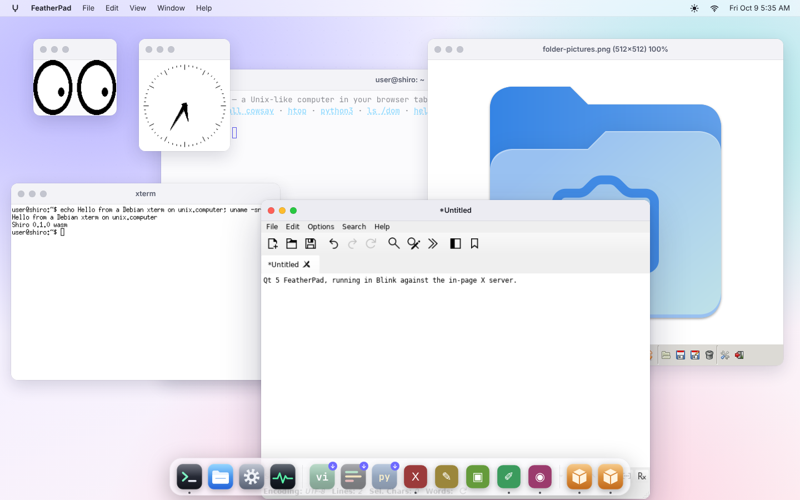
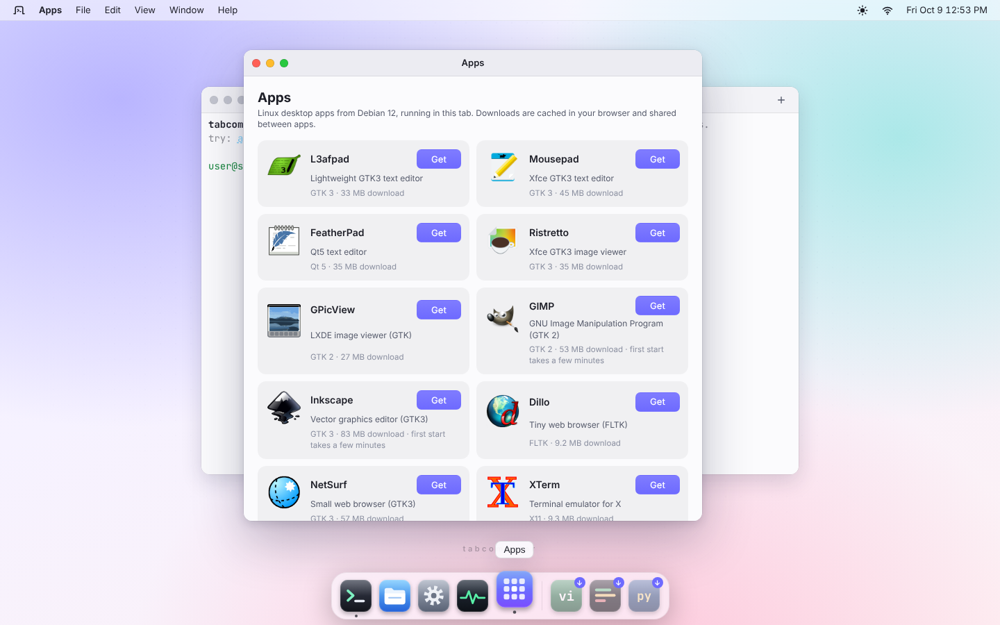
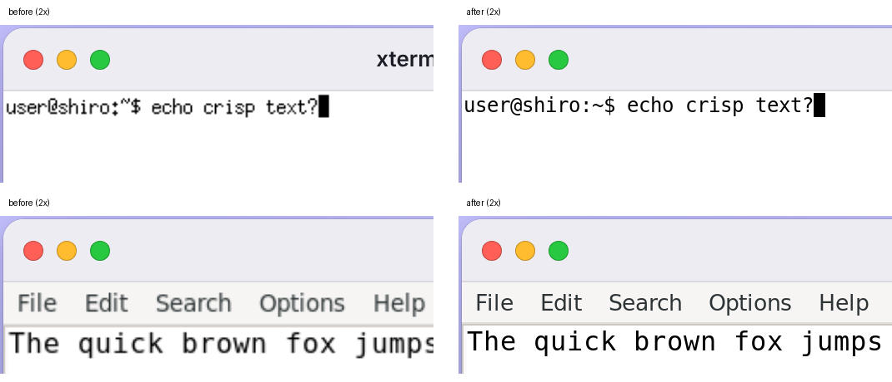

# Linux GUI apps (X11)

Unmodified Linux GUI programs run in tabcomputer and show up as ordinary desktop
windows: an X11 server written in TypeScript runs in the page (`Xshiro :0`,
a kernel process), x86-64 Debian binaries run in Blink and connect to it over
the kernel's AF_UNIX socket `/tmp/.X11-unix/X0`, and each top-level X window
becomes a desktop window (unix/desktop's `surface` windows, docs/DESKTOP.md).
Apps and their libraries come from Debian bookworm, fetched the first time an
app starts and cached in the browser by content hash.

```sh
gui                      # the apps, what the first launch downloads, installed or not
gui xterm                # install on first use, then start it (in the background)
gui install featherpad   # just install
gui info l3afpad         # packages, sizes, what was left out
xserver                  # display :0: process, clients, windows
```

On the desktop, the dock's **Apps** entry opens a window listing the apps
with their icons (from their Debian packages), what installing each would
download now (less when it shares libraries with installed apps), and a
**Get** button that installs it with a progress bar, then **Open**.
Installed apps get their own dock icon. Opening an app that isn't installed
(`desktop open ID`, `wm.openApp(id)`) shows a download window, then the
app's own window. Any X client can be started directly too
(`DISPLAY=:0` is set in the shell): `xterm &` after `gui install xterm`.

Screenshots: [docs/screenshots/](screenshots/) (`gui-*.png`): the Apps
window (`gui-apps.png`, `gui-apps-installing.png`), the desktop
with xeyes, xclock, xterm, FeatherPad (Qt 5) and GPicView (GTK 2) in
Chromium (`gui-desktop.png`), and one per app, GTK 3 included
(`gui-l3afpad.png`, `gui-mousepad.png`, `gui-ristretto.png`).





## What runs

Measured in headless Chromium 141 (cross-origin isolated, local `server.mjs`
with network to deb.debian.org; 4-vCPU container), `scripts/gui/shoot.mjs`.
"First launch" counts from `gui APP` (packages already installed) to the
window, and to its first drawn frame; "warm" is a second launch in the same
page. Install = download + unpack + triggers, from the network; "from cache" =
the same install again from the browser's Cache Storage (after a filesystem
reset, e.g.).

(Install times here predate the decoding workers and trigger changes; see
"First launch: click to window" below for the current ones.)

| App | Toolkit | Download (first run) | Install | From cache | First frame | Warm | Status |
|---|---|---:|---:|---:|---:|---:|---|
| xeyes | Xlib/Xt, SHAPE | 7.5 MB (25 pkgs) | 1.9–2.0 s | 1.4–1.5 s | 0.9–1.3 s | 0.5 s | works (shaped window, follows the pointer) |
| xclock | Xaw, RENDER | 8.9 MB | 0.2–0.5 s¹ | 1.7 s | 2.6–2.8 s | 1.4 s | works (antialiased hands via RENDER) |
| xterm | Xaw, core fonts, pty | 9.3 MB (33 pkgs) | 2.1 s | 1.7 s | 2.5–2.7 s | 1.6–1.9 s | works: tabcomputer's shell in its pty, typing |
| l3afpad | GTK 3.24 | 33.1 MB (81 pkgs; closure 51 MB) | 10.3–12.2 s | 11.9 s | 12.9 s | — | works (Adwaita, menus, typing) |
| mousepad | GTK 3.24 (Xfce) | 44.6 MB (86 pkgs) | 5.6 s¹ | 14.5 s | 32 s | 25.6 s | works; slow start (it waits on D-Bus/xfconf first) |
| ristretto | GTK 3.24 (Xfce) | 35.1 MB (97 pkgs) | 10.9 s | 11.5–12.5 s | 14.4–15.5 s | 13.1 s | works (opens a PNG; no thumbnails without tumbler) |
| gpicview | GTK 2.24 | 26.8 MB (64 pkgs) | 4.8–7.6 s | 7.2–7.6 s | 6.9–9.7 s | 6.7 s | works (opens a PNG) |
| featherpad | Qt 5.15 (xcb) | 35.0 MB (73 pkgs; closure 84 MB) | 6.1–7.8 s | 7.0–8.2 s | 10.5–16 s | 8.9–14.7 s | works (menus, icons, editing) |
| GIMP 2.10 | GTK 2.24, GEGL | 53.2 MB (83 pkgs; closure 141 MB) | 18.3–19.2 s | 21.8 s | 290 s³ | 84 s³ | works: main window, menus (stretch app) |
| lximage-qt | Qt 5.15 | 36.8 MB | 7.4–8.7 s | — | — | — | exits: no D-Bus session bus, so its single-instance check thinks another copy runs |

Ranges are the runs of this session (the 4-vCPU container was busy to
different degrees). "Warm" is close + start again in the same page: it is
about as slow as the first start because startup time is Blink loading and
relocating ~70–100 shared libraries and running toolkit init, not
downloading.

¹ sharing most packages with an app installed just before.
³ to the main window. The first start queries all ~100 plug-ins (each one a
Blink process) and writes GIMP's caches to `~/.config/GIMP`; later starts
read them. Plug-ins whose libraries aren't in the startup set (22 of them:
PDF, HEIF, WebKit help, ...) are removed at install so GIMP doesn't try them.

GTK 3 stalled in Chromium (and in ~2 of 3 Node runs with the JIT) right
after mapping its first window until Blink patch 0029 (SSE compares wrote
wrong masks / NaN results, which cairo/pixman loops on); it was reported to
perf-blink with the gui-probe repro and fixed there.

Status per app also in [COMPAT.md](COMPAT.md#linux-gui-apps-unixgui).

### Heavier apps: Inkscape, NetSurf, Dillo

From a fresh profile in Chromium, opened like a click:

- **Inkscape 1.2.2** (GTK 3 + gtkmm, 140 packages, 83 MB of a 95 MB
  closure): installed in 15 s; its welcome dialog appears 61 s after the
  click; closing it opens the main window ~60 s later, and the ellipse tool
  draws on the canvas (`gui-inkscape.png`, `gui-inkscape-welcome.png`). Its
  windows carry `WM_CLASS` "org.inkscape.inkscape", so desktop windows are
  matched to apps by `_NET_WM_PID` (the kernel pid the app was started
  with) before falling back to `WM_CLASS`. Not shipped: Python (its
  extensions), spell checking.
- **NetSurf 3.10** (GTK 3): the welcome page is rendered 24.7 s after the
  click (`gui-netsurf.png`); most of its 57 MB is shared with the other
  GTK 3 apps.
- **Dillo 3.0.5** (FLTK): 9 MB, installed in 1.4 s, window in 4.1 s
  (`gui-dillo.png`).

**Both browsers load real pages** over tabcomputer's networking:
`gui netsurf https://www.debian.org/` renders Debian's home page with its
images and CSS ("Done (26.2s)", `gui-netsurf-web.png`); Dillo shows
https://example.com/ (`gui-dillo-web.png`). The path, from a kernel trace:
glibc's resolver finds no `/etc/resolv.conf` and asks 127.0.0.1:53, which
the kernel's datagram socket answers with DNS-over-HTTPS; TCP goes through
the server's WebSocket relay (`TABCOMPUTER_TCP_RELAY=1`, on at tabcomputer.com).
TLS needs the CA bundle `update-ca-certificates` would build: it ships as an
overlay (`/etc/ssl/certs/ca-certificates.crt`), plus a tar overlay with its
hashed-name links for OpenSSL users that only look up `/etc/ssl/certs/HASH.0`
(Dillo's https plug-in, now in its startup set with libssl3), and apps get
`SSL_CERT_FILE` pointing at the bundle. (The screenshots come from a sandbox
whose egress re-signs TLS: there its CA was added to the guest's store for
the test, and the browser used the sandbox's HTTP proxy for DoH. Without
the CA, NetSurf rightly shows "Privacy error".)

### First launch: click to window

`tests/browser/gui-first-launch.mjs` opens each app the way a click does
(`desktop.openApp`) in a **fresh browser profile** (empty Cache Storage and
filesystem), times it to the app's X window and its first drawn frame, then
closes it and opens it again (warm). `--debs https://tabcomputer.com/debian/`
takes the packages from the live site's mirror instead of the local server.
Chromium 141, 4 vCPUs, local server with its .deb cache warm:

| App | Download | Before: install / window | Now: install / window | Warm window |
|---|---:|---:|---:|---:|
| l3afpad | 33 MB, 81 pkgs | 11.4 s / 20.9 s | 4.9 s / 12.5 s | 4.9 s |
| mousepad | 42 MB, 86 pkgs | 13.4 s / 33.5 s | 6.2 s / 24.2 s | 17.1 s |
| ristretto | 32 MB, 97 pkgs | 9.9 s / 21.0 s | 4.9 s / 14.8 s | 7.0 s |
| GIMP (main window) | 51 MB, 83 pkgs | 19 s / 290 s | 6.3 s / 247 s | 63 s |

With the packages from tabcomputer.com's mirror (a real network: ~6–10 MB/s
from this container) l3afpad's window comes at 13.0 s and ristretto's at
15.3 s: the downloads overlap the decoding, so the network adds ~0.5–1 s.

Where the time went, and what changed:

- **Decoding the .debs** was most of the install: JavaScript xz runs at
  ~25 MB/s and a GTK 3 closure is 140–180 MB of tar (adwaita-icon-theme
  alone 1 s). It now runs in a pool of workers (`src/gui/deb-worker.ts`, up
  to 4), largest packages first so the long poles start at once, with up to
  16 packages fetched and decoding ahead of the in-order file writes
  (writing 10,000 files takes only ~0.15 s).
- **Triggers** run in parallel, and only when a package just unpacked put
  files in their directory (installing xeyes after a GTK app no longer
  recompiles schemas). gdk-pixbuf's `loaders.cache` for
  libgdk-pixbuf-2.0-0's own loaders ships as an overlay, so
  `gdk-pixbuf-query-loaders` (1–2 s in Blink) runs only when another
  package adds a loader.
- **Adwaita's `icon-theme.cache`** ships as an overlay (built by
  gen-apps.py with gtk-update-icon-cache): GTK no longer scans the theme's
  directories, ~0.7 s off every GTK 3 start.
- The rest is the app starting in Blink. A first start in a page is ~3 s
  slower than the next one with the same files (not fontconfig's or GTK's
  caches: measured); mousepad's 17 s is syscall-free guest compute
  (GtkSourceView). Both were sent to perf-blink with this script as the
  repro. GIMP's first start is its own first-run work (plug-in queries,
  `~/.config/GIMP`).

## How it works

### Choosing the display route (measured)

| Route | Result |
|---|---|
| Debian's real Xvfb (x86-64) in Blink, plus a compositing bridge | Starts (3 s to keyboard init) but needs hard links (`/tmp/.X0-lock`), uid 0 for `-nolock`, and an xkbcomp child through `popen`; pulls 69 MB of debs (Mesa, LLVM); and has no rootless mode: every window's pixels would have to be read back through the socket, rendered by an interpreted pixman. |
| Wayland compositor (wl_shm) | wl_shm needs a client's memfd mapping to be shared with the compositor. Blink copies `MAP_SHARED` file mappings into the guest and writes them back only on `msync`/`munmap`, so buffers never reach the compositor. GTK 3 and Qt 5 both speak X11 anyway. |
| **X11 server in the page (this)** | Rootless by construction, zero download (the 180 KB gzip chunk loads on the first client), drawing in V8-compiled JS straight into per-window backing stores, composed into the desktop's canvases. Debian xeyes connected through Blink + the kernel's AF_UNIX socket and mapped its window 1.1 s after spawn on the first try. |

### The server (`src/x11/`)

- `server.ts`: connection setup (one 24-bit TrueColor screen plus a 32-bit
  ARGB visual; pixmap depths 1/8/16/24/32), the core protocol (windows and
  stacking, properties, atoms, selections, GCs, all drawing requests,
  images, core fonts, colors, cursors, grabs, focus, keyboard and pointer
  events with propagation and implicit grabs), and extensions BIG-REQUESTS,
  XC-MISC and SHAPE. Every drawable owns a `Pix` (Uint32Array of X pixel
  values); there is no shared framebuffer, so nothing needs Expose for being
  uncovered.
- `raster.ts`: the core rasterizer: spans clipped by GC clip rectangles or
  masks, raster functions, plane masks, tiles and stipples, thin/wide/dashed
  lines, arcs, polygons with both fill rules, images (XYBitmap, XYPixmap,
  ZPixmap; LSBFirst, pad 32), glyph text.
- `render.ts`: RENDER 0.11 in software: formats a8r8g8b8, x8r8g8b8, a8, a1,
  r5g6b5; Porter-Duff operators (premultiplied), solid/linear/radial/conical
  sources, transforms with nearest/bilinear filters, repeat modes, clips;
  glyph sets (Xft, cairo, Qt text); antialiased trapezoids and triangles
  (4× vertical, exact horizontal coverage); ARGB cursors.
- `fonts.ts` + `fonts-data.ts`: the misc-fixed bitmap fonts of Debian's
  xfonts-base (public domain), converted by `scripts/gui/gen-fonts.py`, with
  their XLFD names and aliases (`fixed`, `9x15`, ...). Names that match
  nothing fall back to the closest fixed size instead of BadName.
- `keymap.ts`: KeyboardEvent.code → evdev keycodes (+8, like Xorg), a US
  core keymap; characters the layout can't type get a spare keycode remapped
  on the fly (MappingNotify), and Shift is synthesized when a shifted
  character arrives without a Shift keydown.
- The root window carries a `RESOURCE_MANAGER` with `Xft.dpi: 96` and font
  rendering defaults (Qt drew 1 px text without it).
- `compose.ts`: composes a toplevel's subtree (borders, stacking, SHAPE
  clipping of descendants, ARGB windows) into RGBA for `putImageData`, only
  over the damaged rectangle.
- `rootless.ts`: toplevels ↔ desktop windows. Title (`_NET_WM_NAME`,
  `WM_NAME`), size hints (min/max, resize increments), transient dialogs,
  undecorated windows (override-redirect, `_MOTIF_WM_HINTS`, menu/tooltip
  window types), close → `WM_DELETE_WINDOW` (or kill the client), focus →
  `SetInputFocus` + `WM_TAKE_FOCUS`, user moves → synthetic ConfigureNotify
  like a reparenting WM, user resizes → ConfigureWindow. Pointer, buttons,
  wheel (40 px per click → buttons 4/5/6/7) and keys come in as normalized
  input events. The window's app id is the `WM_CLASS` instance, so dock
  icons find their windows.
- `clipboard.ts`: CLIPBOARD ↔ browser clipboard, through an X client inside
  the server (`internalClient`). An app that copies takes CLIPBOARD; the
  bridge converts it to UTF8_STRING and calls `navigator.clipboard
  .writeText`. When the browser clipboard may hold something new (a copy
  elsewhere in the page, or the tab regains focus), the next X window to
  get focus finds the bridge owning CLIPBOARD, and pastes are answered from
  `readText()` (TARGETS, UTF8_STRING, STRING, TEXT, text/plain).
  Screenshot: `gui-clipboard.png` (copied in L3afpad, pasted from the page).
- `display.ts`: `Xshiro :N`, a kernel process (it shows in `ps`) listening on
  `/tmp/.X11-unix/XN` and on the abstract name libxcb tries first; started at
  boot, ~1 KB. `session.ts` creates the server on the first connection.

### DOM text (experimental)

`xserver text dom|overlay` shows core X text (ImageText/PolyText) as
positioned `<span>`s over the window instead of (or over) glyph pixels:
sharp, selectable with Alt + drag, and visible to assistive tech. It works
for Xlib/Xaw apps (xterm, xcalc, xedit); GTK, Qt and FLTK send text as
pixels. Design note, measurements and next steps:
[DOM-RENDERING.md](DOM-RENDERING.md).

### Window hosts (`src/gui/`)

`window-host.ts` is the interface rootless windows need (shaped like the
desktop's Surface: `present`, normalized input, configure). `desktop-host.ts`
implements it with `createWindow({content: {kind: 'surface', scale,
autoResize: false}})`. `standin-host.ts` is a self-contained floating-window
host for the classic full-page terminal UI.

### HiDPI: one X pixel is one device pixel

Xshiro's screen is in **device pixels**: `displayScale()`
(`src/gui/display-scale.ts`) is `devicePixelRatio` when the display starts
(rounded to quarters, at least 1). Both hosts convert to CSS px at their
boundary (sizes, positions, drags ÷ scale), and each window's canvas is
exactly buffer ÷ scale CSS px, so the browser never resamples it: no
stretching even when the desktop makes a window bigger than the client
drew (xterm snapping to whole cells used to stretch its 466 px buffer
over a 484 px window, blurring text even at 1×), and `image-rendering:
pixelated` at whole-number scales. Clients are told the real resolution:

- the screen's size in mm and `Xft.dpi` = 96 × scale, `Xcursor.size`
  24 × scale (cursors become CSS `image-set(… Nx)` cursors);
- GTK: `GDK_SCALE` = ⌊scale⌋ with `GDK_DPI_SCALE` = 1/⌊scale⌋ (GTK scales
  widgets by whole numbers only; fonts follow Xft.dpi); Qt:
  `QT_SCALE_FACTOR` = scale, `QT_FONT_DPI=96`. Set for apps the installer
  starts and exported into the shell's environment;
- xterm switches from bitmap `fixed` (which can't scale) to DejaVu Sans
  Mono 9 pt above 96 dpi (`XTerm*faceName` in RESOURCE_MANAGER).

Plain Xlib/Xaw apps with fixed pixel sizes (xeyes, xclock, xcalc) come out
at their pixel size, i.e. smaller on a 2× screen, but sharp. The scale is
read once, when the display starts: changing the browser zoom afterwards
needs a reload.



(`gui-hidpi-2x.png`, `gui-hidpi-3x.png`: xterm and L3afpad in Chromium at
deviceScaleFactor 2 and 3, before and after.)

### Packages: content addressed, streamed on first use

- `public/gui/apps.json` is generated offline by `scripts/gui/gen-apps.py`
  from Debian's Packages index: for each app, the dependency closure is
  unpacked and reduced to what the app needs to *start*: the ELF `DT_NEEDED`
  closure of its binaries and of the plugins it always loads (Qt's xcb
  platform plugin, gdk-pixbuf loaders, babl), plus the
  architecture-independent data packages (themes, icons, fonts, schemas)
  that a kept package depends on. Optional plug-ins (GIMP's plug-ins, GEGL
  ops) are kept when their libraries are already in that set, otherwise
  the manifest lists them under `remove` and the installer deletes them. Libraries reached only by
  `dlopen` of optional modules — Mesa and LLVM through libglvnd (Qt asks for
  GLX, which Xshiro doesn't offer), CUPS print backends, Kerberos, ICU via
  libxml2 — are never downloaded. That halves Qt (84 → 35 MB).
- Each package is identified by the sha256 of its `.deb` from the signed
  index. `src/gui/apps.ts` looks it up in the browser's Cache Storage under
  that hash (shared by all apps, kept across filesystem resets), else fetches
  `GET /debian/pool/...` (server.mjs's Debian mirror, shared with apt in
  Debian mode: see [DEBIAN.md](DEBIAN.md), "Package mirror"; it caches on
  disk and falls back to snapshot.debian.org when a point release removed
  the file), verifies the hash, and unpacks it in the
  page (ar, then data.tar.xz/zst/gz with tabcomputer's JS codecs). Docs, man pages
  and translations are skipped; files a library package would put over
  tabcomputer's own commands in `/usr/bin` are skipped too.
- Then the postinst work dpkg triggers would do runs in Blink:
  `gdk-pixbuf-query-loaders --update-cache`, `glib-compile-schemas`.
  Each runs only when a package just unpacked put files in its directory.
  Generated files whose generator would cost more than they do are built
  once by gen-apps.py and shipped content-addressed as overlays
  (`public/gui/overlay/<sha256>`, fetched alongside the packages):
  `/usr/share/mime/mime.cache` (148 KB), without which GIO can't sniff file
  types and gdk-pixbuf can't load PNGs (update-mime-database needs libxml2 +
  ICU, 10 MB); Adwaita's `icon-theme.cache`; and gdk-pixbuf's
  `loaders.cache` (made in Blink, kept in `scripts/gui/overlays/`); the CA
  bundle and its hashed links (a `tar` overlay, unpacked like a package).
- The .debs are decoded in workers (`src/gui/deb.ts`), largest first, while
  more download; files are written in that order on the page's thread.
- State: `/var/lib/shiro-gui/status.json` (package versions, apps).
- **Debian mode** (`debian install`, [DEBIAN.md](DEBIAN.md)): the system is
  then a dpkg-managed Debian 13 rootfs, so `gui APP` installs with the
  system's own `sudo apt-get install` (the manifest's `pkg`) instead, and
  dpkg runs the real triggers. The streamer above is for plain tabcomputer: it
  unpacks Debian 12 packages without dpkg, which must not land on a trixie
  system. Any other X program works the same way in Debian mode:
  `sudo apt install x11-apps && xeyes &`. Measured in Chromium: `debian
  install` 0.5 s, then `gui install xeyes` = `apt-get update` + `apt-get
  install x11-apps` and its dependencies, with dpkg's triggers, in Blink:
  384 s; trixie's xeyes then maps its window 1.0 s after launch
  (`docs/screenshots/gui-debian-apt-xeyes.png`).

## Tests

- `tests/tests/shiro-vitest/x11.test.ts`: protocol (setup, windows, Expose,
  drawing and composition, PutImage/GetImage/CopyArea, properties, input
  events with implicit grabs, resize with bit gravity, core fonts, selections,
  SHAPE, RENDER fills/glyphs/trapezoids, key mapping, the clipboard bridge
  both ways), and the kernel path:
  a static x86-64 client (`fixtures/x86/xclient.c`, raw protocol) in Blink
  connects to `Xshiro :0`, draws, gets a button press and resizes itself.
- `gui-apps.test.ts`: `.deb` parsing, install (hash check, symlinks, skipped
  docs, status), launching the installed ELF on the display, triggers that
  run only for packages that touch their directory, one install shared by
  several callers, the download left to do.
- `tests/browser/gui-first-launch.mjs`: click-to-window from a fresh
  profile (above).
- `kernel-pty.test.ts`: `/dev/tty` after a session leader acquires a pty
  (xterm's child needed it).
- `gui-probe.test.ts` (manual, `GUI_PROBE_ROOT`): run any Debian rootfs X
  client in Blink against a headless Xshiro; reports timings, X request
  counts, syscalls in flight and PNGs (`scripts/gui/debfetch.py` builds the
  rootfs).
- `scripts/gui/shoot.mjs`: the browser numbers and screenshots above.
- `scripts/gui/xdev.ts`: the server on a real Unix socket under Node for
  native clients (fast protocol debugging).

## Known gaps and next steps

1. **A D-Bus session bus** (dbus-daemon in Blink on an AF_UNIX socket):
   lximage-qt quits without one, Mousepad and GApplication-based apps wait
   on it, and portals/thumbnailers need it.
2. **Speed of toolkit startup** is Blink's: Qt reaches its first frame in
   ~10 s, GTK 2 ~15 s. Snapshotting a started process, caching JIT output
   across runs, and WASM builds of the toolkits (Qt for WebAssembly has an
   xcb-less platform; GTK's Broadway) are the levers.
3. **PRIMARY** (select, middle-click paste) works between X apps only; the
   browser has no primary selection to bridge it to.
4. **Extensions not yet offered**: MIT-SHM (Blink can't share guest memory
   with the page yet), XKEYBOARD (toolkits fall back to the core keymap),
   XInputExtension 2 (core input only: no smooth scrolling or touch),
   RANDR (one fixed screen = the work area when the server starts), XFIXES,
   DAMAGE, Composite, GLX.
5. **HiDPI** follow-ups: rescale when devicePixelRatio changes (browser
   zoom, a window moved to another monitor) via RANDR + XSETTINGS; scale
   fixed-size Xaw apps.
6. **Per-file laziness**: packages are fetched whole, before start; a kernel
   open hook (unix/kernel) would let files materialize on first open.
7. **Wayland** (wl_shm) once Blink can share mappings with the page.
8. Heavy apps: GIMP and Inkscape run, with long first starts. GIMP's would
   drop to its second-start time with plug-in caches (`pluginrc`) shipped
   as an overlay, which needs the unpacker to keep the packages' file times
   (GIMP compares them).

