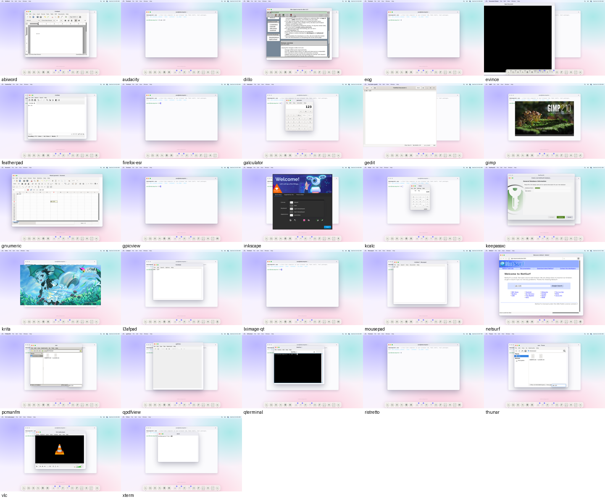
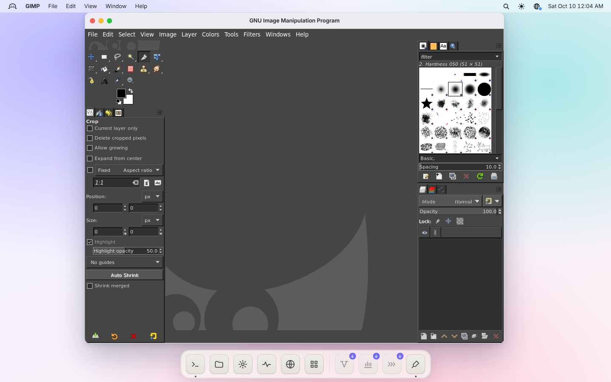
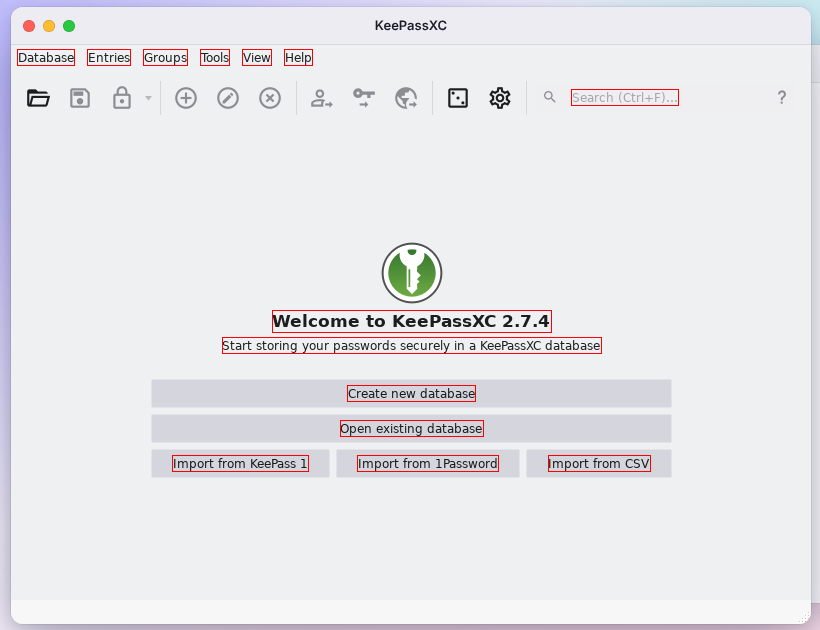
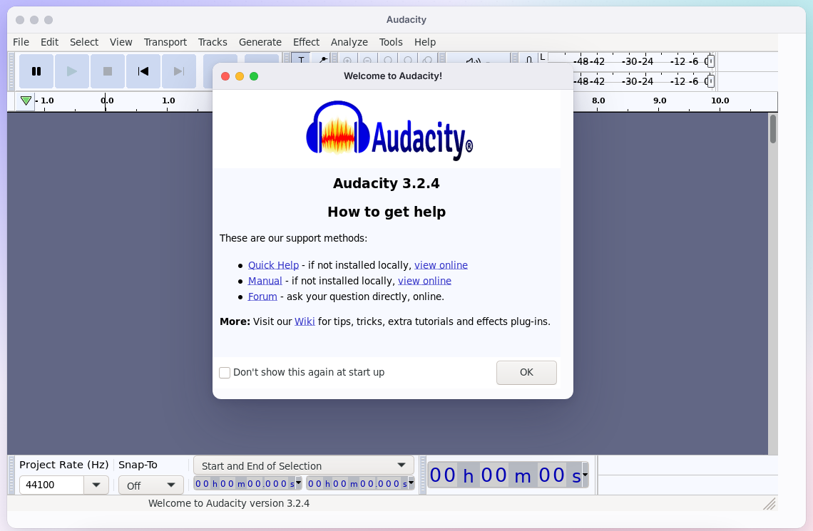

# GUI app scoreboard

Debian 12 GUI apps installed from the streaming manifest (`public/gui/apps.json`, docs/GUI.md) in the built app, in headless Chromium (4 vCPUs), by `scripts/gui/score.mjs` (`npm run gui-score`). Each app in a fresh browser profile (nothing cached in the browser; the local server's .deb cache warm); text mode `overlay` (docs/DOM-RENDERING.md).

Columns: **installs**; **window**: a desktop window appears, with the time from launch (installed) to it; **renders**: its largest window isn't one flat colour after 8 s; **input**: focusing it and typing `abc 123` changes its pixels (or, if not, clicking into its middle and typing does, or Ctrl+O opens a window or changes them); **text**: the DOM text layer has spans for it (GTK via libshiro-text-hook.so, core X text; Qt and others draw pixels only).

**29/29 install, 27/29 open a window, 26/29 render, 20/29 react to input, 20/29 have DOM text.**


### Editors & viewers

| App | Toolkit | Download | Install | Window | First window | Renders | Input | Text | Notes |
|---|---|---:|---:|:-:|---:|:-:|:-:|:-:|---|
| mousepad | gtk3 | 47.3 MB | 7.7 s | ✓ | 21 s | ✓ | ✓ | ✓ (7) |  |
| gedit | gtk3 | 52.1 MB | 8.4 s | ✓ | 21 s | ✓ | ✓ | ✓ (11) |  |
| l3afpad | gtk3 | 45.8 MB | 7.2 s | ✓ | 8.9 s | ✓ | ✓ | ✓ (6) |  |
| evince | gtk3 | 55.4 MB | 9.3 s | ✓ | 22 s | ✓ | ✓ | ✓ (3) |  |
| eog | gtk3 | 53 MB | 9.7 s | ✓ | 21 s | ✓ | ✗ | ✗ | input: a viewer with nothing open: typing changes nothing |
| ristretto | gtk3 | 47.8 MB | 6.6 s | ✓ | 14 s | ✓ | ✗ | ✗ | input: a viewer with nothing open: typing changes nothing |
| gpicview | gtk2 | 39.6 MB | 5.1 s | ✓ | 4.7 s | ✓ | ✗ | ✗ | input: a viewer with nothing open: typing changes nothing |

### Graphics

| App | Toolkit | Download | Install | Window | First window | Renders | Input | Text | Notes |
|---|---|---:|---:|:-:|---:|:-:|:-:|:-:|---|
| gimp | gtk2 | 66.1 MB | 8.9 s | ✓ | 34 s | ✓ | ✓ | ✓ (2) |  |
| inkscape | gtk3 | 83 MB | 14 s | ✓ | 54 s | ✓ | ✓ | ✓ (18) |  |
| krita | qt5 | 118.3 MB | 8.4 s | ✓ | 14 s | ✓ | ✗ | ✓ (1) | input: its start screen has nothing to type into (passed in one run of three) |
| blender | gl | 231.5 MB | 18 s | ✗ | – | – | – | – | exited (status 134) before a window; past OpenCV's CPU check (engine fix); now glibc aborts on PI-mutex futex ops (EINVAL in the x86 engine, reported) |

### Desktop

| App | Toolkit | Download | Install | Window | First window | Renders | Input | Text | Notes |
|---|---|---:|---:|:-:|---:|:-:|:-:|:-:|---|
| pcmanfm | gtk2 | 43.6 MB | 5.8 s | ✓ | 8.9 s | ✓ | ✓ | ✓ (5) |  |
| thunar | gtk3 | 48.6 MB | 6.6 s | ✓ | 15 s | ✓ | ✓ | ✓ (18) |  |
| xterm | x11 | 9.3 MB | 1.4 s | ✓ | 3.0 s | ✓ | ✓ | ✓ (1) |  |
| galculator | gtk3 | 46 MB | 6.5 s | ✓ | 13 s | ✓ | ✓ | ✓ (59) |  |

### Office

| App | Toolkit | Download | Install | Window | First window | Renders | Input | Text | Notes |
|---|---|---:|---:|:-:|---:|:-:|:-:|:-:|---|
| gnumeric | gtk3 | 64.3 MB | 7.8 s | ✓ | 27 s | ✓ | ✓ | ✓ (19) |  |
| abiword | gtk3 | 81.2 MB | 9.0 s | ✓ | 28 s | ✓ | ✓ | ✓ (22) |  |
| libreoffice-writer | gtk3 | 155.1 MB | 17 s | ✗ | – | – | – | – | no window in 420 s; loads now (ELF .bin, libcups); an uncaught UNO RuntimeException at startup, then it hangs (not diagnosed) |

### Internet & media

| App | Toolkit | Download | Install | Window | First window | Renders | Input | Text | Notes |
|---|---|---:|---:|:-:|---:|:-:|:-:|:-:|---|
| firefox-esr | gtk3 | 125.1 MB | 30 s | ✓ | 257 s | ✗ | – | ✗ | past the getaddrinfo abort (fixed): a blank window after minutes, gone seconds later; content processes crash (SIGSEGV) |
| netsurf | gtk3 | 56.6 MB | 7.2 s | ✓ | 13 s | ✓ | ✓ | ✓ (42) |  |
| dillo | fltk | 11.4 MB | 1.4 s | ✓ | 5.1 s | ✓ | ✓ | ✗ | FLTK draws its text as pixels |
| vlc | qt5 | 39.4 MB | 5.1 s | ✓ | 13 s | ✓ | ✓ | ✓ (11) |  |
| audacity | gtk3 | 64.3 MB | 7.9 s | ✓ | 37 s | ✓ | ✗ | ✗ | its first window is the first-run plugin scan; the main window follows (~70 s); wxWidgets text isn't reported |

### Qt

| App | Toolkit | Download | Install | Window | First window | Renders | Input | Text | Notes |
|---|---|---:|---:|:-:|---:|:-:|:-:|:-:|---|
| featherpad | qt5 | 34.9 MB | 4.9 s | ✓ | 8.8 s | ✓ | ✓ | ✓ (6) |  |
| qterminal | qt5 | 34.2 MB | 4.3 s | ✓ | 9.1 s | ✓ | ✓ | ✓ (7) |  |
| qpdfview | qt5 | 39.2 MB | 4.5 s | ✓ | 13 s | ✓ | ✓ | ✓ (6) |  |
| keepassxc | qt5 | 48 MB | 5.3 s | ✓ | 21 s | ✓ | ✓ | ✓ (21) |  |
| kcalc | qt5 | 44.4 MB | 5.2 s | ✓ | 13 s | ✓ | ✓ | ✓ (8) |  |
| lximage-qt | qt5 | 36.8 MB | 4.5 s | ✓ | 8.5 s | ✓ | ✗ | ✗ | input: a viewer with nothing open: typing changes nothing |

2026-10-10; per-app details (output tails, window titles) in .gui-score/results.json.

<!-- notes: everything below is kept when the tables are regenerated -->



## Failures and fixes

Fixed while building the scoreboard (scores above are after these):

- **GIMP's toolbox and dock icons were blank.** Two causes. GTK apps had no SVG
  loader for gdk-pixbuf: `librsvg2-common` is now part of every GTK app's set,
  with a loaders.cache overlay that lists it (`scripts/gui/overlays/gdk-pixbuf-loaders-svg.cache`).
  That made plain SVG icons work, but GIMP's own themes (Symbolic, Color) draw
  every icon with a gradient fill, and librsvg's gradients come out fully
  transparent in the x86 engine (cairo and pixman gradients called directly are
  fine; reported to the engine owners with a repro). Until that is fixed, GIMP
  starts with its PNG "Legacy" icon theme: the launcher writes
  `~/.config/GIMP/2.10/gimprc` with `(icon-theme "Legacy")` when there isn't one
  (manifest field `home`; GIMP ignores the setting in its system gimprc).
  
  Cost: the SVG loader adds librsvg and its dependencies, about 12.7 MB per GTK
  app (l3afpad 33.1 → 45.8 MB, GIMP 53.2 → 66.1 MB) — cached once, shared by all.
- **Krita and Audacity were missing libraries** (Audacity then stops at SysV IPC, below): the library closure
  now follows each ELF's RUNPATH/RPATH (PulseAudio's private `libpulsecommon`
  pulls `libsndfile` from there) and Audacity gained `libsoxr0`.
- **Krita opened a "Fatal error" window**: its resources live in an SQLite
  database and Qt's SQLite driver is a plugin (not in the ELF closure):
  `libqt5sql5-sqlite` is now in its set.
- **Blender failed to find LAPACK/BLAS**: Debian picks them with
  update-alternatives in a postinst; the manifest now carries those symlinks
  (`links`) and the installer makes them.
- **Galculator couldn't save its settings** (`~/.config` missing): the
  installer creates the XDG base directories in the home.
- **The scoreboard itself**: one fresh browser profile per app (a shared one
  filled its storage), early exit detection (no 7-minute wait for an app that
  died), windows titled like errors ("Fatal error", "Startup Failure") count as
  no window.

Second round (after the first scoreboard; the coordinator's list):

- **Typing into a just-opened app went nowhere** until it was clicked, and so
  did shortcuts (Ctrl+O): the desktop focuses a new window while creating
  it, before the X side listens, so the client never got FocusIn
  (`desktop-host.ts`). The common cause of most "input ✗" rows on apps
  with a text field.
- **No D-Bus session bus**: the launcher now starts Debian's `dbus-daemon`
  (manifest entry `dbus-session`, 0.4 MB) with the first app.
  LXImage-Qt's single-instance check needed it (it exited at once); GTK and
  Qt apps stop failing their settings and portal lookups.
- **Firefox ESR aborted ~20 s in** on a glibc assertion in `getaddrinfo`
  (`IN6_IS_ADDR_V4MAPPED`), not a MOZ_CRASH: glibc sorts DNS answers by
  connecting one IPv6 UDP socket to each, an IPv4 answer with its own
  `AF_INET` sockaddr, and the kernel gave that connect a plain IPv6 source
  instead of a v4-mapped one, as Linux does (`src/kernel/net.ts`). It now
  gets to its window (after minutes).
- **VLC ran with only its Qt interface**: gen-apps.py kept an optional
  plugin only when its package was needed anyway, and nothing needs
  `vlc-plugin-base`, so all of its 288 plugins (logger, demuxers, file
  access, video outputs) were left out. A plugin may now bring its own
  package (376 plugins left out before, 88 now; +3.3 MB). With logging back,
  VLC shows why it quits: `sigwait()` returns ENOSYS.
- **LibreOffice** loads now (engine fix for `.bin` executables) and found
  `libcups.so.2` missing: `libreoffice-core-nogui`'s `libmergedlo.so` (no
  libcups) shadowed `libreoffice-core`'s in the closure; it is skipped.
- **Qt apps had no DOM text**: `libshiro-qt-text-hook.so` interposes the
  exported `QPainter::drawText` overloads (which QStyle calls from QtWidgets:
  menus, buttons, labels, tabs, items) and reports the runs like the GTK
  hook. Qt keeps a backing store and re-puts unchanged pixels, so each window
  keeps the runs it shows and they follow every put of their area.
  
- **Every GTK start stat'ed all of hicolor** (~1.6 s): there was no
  `icon-theme.cache` for it. The installer now writes GTK's cache format
  itself (`src/gui/icon-cache.ts`) whenever a package adds icons there.

- **Audacity and VLC run** on the engine fixes that followed the reports:
  SysV shared memory and semaphores (Blink 0069/0077 and the kernel's
  sysvsem) for Audacity's single-instance lock, `rt_sigtimedwait` (Blink
  0087) for VLC's `sigwait()`. Audacity's first start scans its plug-ins
  first; its main window follows (~70 s). The scoreboard's render check now
  looks at all of an app's windows (VLC's largest surface was a blank
  video window).
  

Where the startup time goes (`LD_PRELOAD` timing of every file open; l3afpad,
window at 8.2 s after the fixes, 9.9 s before): ~1.0 s of dynamic linking
before any app code; GTK and GDK setup to ~3 s; icon themes 0.5 s (2.0 s
before the hicolor cache); fontconfig rescans the fonts and writes its caches
(~1.9 s, first launch in a profile only: the caches persist); then the first
window. In Inkscape most of its time is its own code: ~9 s right after
ImageMagick's init, ~13 s before reading its recent files, ~8 s rendering
icons. That's guest computation, so the x86 engine's speed, not files.
Shipping fontconfig's caches would need the font directories' mtimes pinned
(fontconfig checks them) and is left for later.

Known failures, not fixed here:

| App | What happens | Where it has to be fixed |
|---|---|---|
| blender | past OpenCV's CPU check now (engine fix: CPUID family 6); glibc aborts: "The futex facility returned an unexpected error code" — PI-mutex futex ops (LOCK_PI, UNLOCK_PI…) and REQUEUE/WAKE_OP return EINVAL | x86 engine (reported) |
| libreoffice-writer | loads; an uncaught UNO `RuntimeException` at startup (release build: no SAL_LOG detail), then it hangs. LibreOffice headless (`soffice --headless --convert-to pdf`, libreoffice-writer-nogui) works (verified 2026-10-10) | not diagnosed |
| firefox-esr | its window opens after ~4 min, blank, and goes away seconds later; its content processes die with SIGSEGV first | not diagnosed |

Input ✗ is left on viewers with nothing open (eog, ristretto, gpicview,
lximage-qt) and Krita's start screen: typing changes nothing there and none
of them answers Ctrl+O with a window in time. Text ✗ is left on FLTK
(dillo), GNOME/Xfce image viewers with no text in view (eog, ristretto,
gpicview), LXImage-Qt and the apps that don't start.

Round by round (29 apps): first scoreboard 24 windows, 23 render, 18 input,
14 DOM text; after the second round (with the engine's fixes merged) 27, 26, 20, 20.

### Re-running

```
npm run build
npm run gui-score                     # every app not scored for its current package versions
npm run gui-score -- --only gimp,krita --rescore
npm run gui-score -- --report-only    # rewrite the tables from .gui-score/results.json
```

Results are cached per app by its exact package versions in
`.gui-score/results.json`, screenshots in `.gui-score/shots/`.
