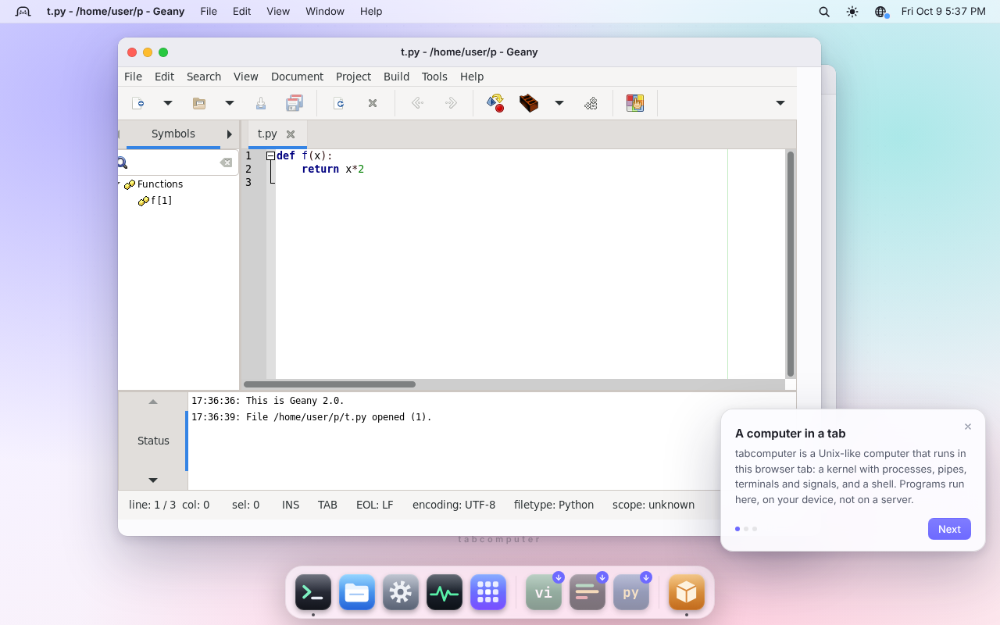

# Developer tools in tabcomputer: tested

Research worker (unix/research), 2026-10-09. Which programmer editors, IDEs
and git tools actually work in tabcomputer, how fast they start, and what
should go in the dock. Ends with a dock-group proposal for the desktop worker.

**Method.** Every row was run on https://tabcomputer.com (production) in
headless Chromium 141, cross-origin isolated, from a fresh browser profile:
- full-screen terminal programs through `scripts/browser-tui.mjs`-style
  keystrokes on the real xterm.js terminal (`?ui=terminal`), timing until
  their screen appeared;
- GUI apps on the desktop with Xshiro, timed until their X window mapped.

Times were measured with several tabcomputer pages sharing a 4-vCPU machine,
so treat them as upper bounds. "Cold" is the first start in a page; "warm"
is the second.

## Results

### Terminal editors

| Editor | Route | Install | Start (cold / warm) | Edit and save | Notes |
|---|---|--:|--:|---|---|
| **vim** 9.2 | `pkg install vim` (static x86-64) | <2 s | 5.2 s / 2.3 s | ✅ `Go…<Esc>:wq` | syntax highlighting, `:help`; the dock already offers it |
| **neovim** 0.12.5 | `pkg install neovim` | <2 s | 7.3 s / 5.1 s | ✅ | Lua 5.1 runtime, `:help` |
| **nano** 9.2 | `pkg install nano` | <1 s | 1.0 s | ✅ `^O ^X` | fastest start; the right default for beginners |
| **emacs** 31.1 (`-nw`) | `pkg install emacs` (26 MB) | ~3 s | 9.0 s / 9.0 s | ✅ `C-x C-s C-x C-c` | python-mode on open; no GUI, TLS or images |
| **micro** 2.0.14 | `apt install micro` (Debian mode) | ~2 min | not verified | not verified | first try: the screen never showed micro; the shell got stray characters (see "typeahead"). Retries were blocked by the classic-terminal regression below |
| **kakoune** 2024.05 | `apt install kakoune` | ~2 min | ~20 s (screenshot at 20 s) | ✅ `i…<Esc>:wq` | works. Keys typed before it started landed in its buffer: see "typeahead" below |
| **helix** | not in Debian trixie; the static GitHub release could not be fetched from this harness (see "Network" below) | — | — | — | untested |

Installs from `pkg` are WASM or static x86-64 builds fetched from
tabcomputer's own package index, so they take seconds. Debian packages take
minutes (download plus dpkg plus triggers, under emulation).

### Terminal multiplexers

| Tool | Route | Result |
|---|---|---|
| tmux 3.8 | `pkg install tmux` | installs in seconds (`tmux -V`); tabcomputer also ships a pty and a builtin tmux layout (`src/tmux-layout.ts`) |
| GNU screen 5.0.2 | `pkg install screen` | installs (`screen --version`) |

### Git tools

| Tool | Route | Result |
|---|---|---|
| git 2.56 (real) | `pkg install git` | ✅ clone over the relay, commit, branch, worktree, merge: see [AGENT-EXPERIMENTS.md](AGENT-EXPERIMENTS.md) |
| tabcomputer's builtin git (isomorphic-git, "2.47.0 (isomorphic-git/shiro)") | default | ⚠️ enough for clone, commit and push, but it has no `rev-parse`, so **every git UI fails on it**: lazygit died with "git: 'rev-parse' is not a git command", tig said "Not a git repository". In Debian mode `git` is still the builtin until `apt install git` or `pkg install git` |
| tig 2.5.8 | `apt install tig` | installs; on the builtin git it says "Not a git repository". With real git: not verified (blocked by the terminal regression below) |
| lazygit 0.50 | `apt install lazygit` (Debian trixie has it) | installs and starts (Go, in Blink); on the builtin git it dies with "git: 'rev-parse' is not a git command". With real git: not verified (terminal regression) |
| gitui | not in Debian trixie; GitHub release untestable here | — |
| git-gui, gitk (Tk) | `apt install git-gui gitk` | available in trixie; not run |

### GUI editors (X11 on the desktop)

| Editor | Route | Install | Window | Result |
|---|---|--:|--:|---|
| **Geany** 2.0 | `apt install geany` (Debian mode), `DISPLAY=:0 geany t.py &` | 12.7 min (with 4 other pages busy) | **30 s** to its window | ✅ Python highlighting, symbol list, status bar ([screenshot](img/geany.png)) |
| Mousepad 0.6 | `gui mousepad` | 5.6–14.5 s from tabcomputer's GUI streamer ([GUI.md](../GUI.md)) | 32 s first frame / 25.6 s warm | works (GUI.md) |
| l3afpad (GTK 3) | `gui l3afpad` | 10–12 s | 12.9 s | works (GUI.md) |
| FeatherPad (Qt 5) | `gui featherpad` | 6–8 s | 10.5–16 s | works (GUI.md) |
| gedit 48 | `apt install gedit` (in trixie) | not run | — | GTK 4 and libadwaita: heavier than Geany; try only if asked for |



### VS Code family

| Option | Result |
|---|---|
| **`code FILE`** (builtin, CodeMirror) | ✅ opens a desktop window editing the file, with highlighting and save back to the VFS. Instant |
| **`monaco FILE`** (builtin, Monaco from jsDelivr) | ✅ opens a window with the Monaco editor (`.monaco-editor` present), file loaded. Needs network for the CDN on first use |
| **code-server** 4.141.0 (`npm install code-server`) | ❌ installs in 8 s (179 MB, `--ignore-scripts`), then fails at start: `Error loading module …/argon2/argon2.cjs`. It needs native addons (argon2, node-pty, @parcel/watcher, spdlog) that tabcomputer's node can't load, and its workbench needs a WebSocket to its server, which the preview window lacks ([SANDBOXES.md](SANDBOXES.md#5-prototype-fullstack-notes)). Under Debian's real node (`apt install nodejs`, 22–26 s per script under emulation, COMPAT.md) the addons might load from prebuilds, but the server would be unusably slow |
| openvscode-server, VSCodium (server) | same architecture as code-server, so same blockers; not on npm; GitHub releases untestable here |
| vscode.dev in a real browser tab | works for editing, but can't see tabcomputer's files: no shared filesystem with the tab's IndexedDB |

**Conclusion for VS Code.** Don't chase code-server now. The cheapest path
to a VS Code-like experience is to grow the builtin Monaco window into a
small IDE:
1. a file tree (the `monaco DIR` form exists, capped at 50 files);
2. multiple tabs;
3. save to the VFS;
4. "Open Terminal here";
5. an LSP later, via a language server running in the guest (pyright and
   typescript-language-server are pure JS) over a kernel pipe.

Revisit code-server when (a) preview windows support WebSockets and (b)
tabcomputer's node loads N-API addons (or the addons get wasm builds).

### Things that hurt usability (verified)

- **Classic terminal regression (reported, routed to desktop).** On
  2026-10-09 around 19:00 UTC, `https://tabcomputer.com/?ui=terminal` at
  1100×700 rendered `#terminal` 33 px wide (3 columns), shrinking to 25 px
  (2 columns) by 8 s. This blocked the remaining full-screen TUI checks
  (micro, tig and lazygit with real git). The desktop Terminal window was
  fine (98×21).

- **Typeahead is lost or misrouted.** Keys typed while a Debian program was
  starting were partly eaten: after `clear` (Debian's, in Blink), typing
  `micro t.py⏎` reached the shell as `y`, and stray letters showed up in the
  next program's buffer (kakoune's file gained "cro t.p"). Real terminals
  queue typeahead for whoever reads the tty next. Worth a pty test.
- **Builtin git looks like real git and isn't** (above). tig and lazygit ran
  their git subcommands against the builtin. Suggestion: make the builtin
  `git` say "`git rev-parse` needs real git: `pkg install git` (or `sudo apt
  install git`)" for subcommands it lacks, instead of git's own "not a git
  command", which reads as a broken repository. Also check whether Debian
  git installed as a dependency really takes over `/usr/bin/git` from the
  builtin (not checked: the rerun was blocked by the terminal regression).
- **First apt install is slow**: `apt-get update` takes 50–90 s, and a
  medium package 2–7 min. For the dock, prefer `pkg` builds (seconds) where
  they exist.
- **Network for downloads.** Static GitHub releases (helix, gitui) are
  fetched through the TCP relay. My test harness's proxy refused the
  relay's WebSocket, so those rows are untested here, not broken.

## Proposal: dock groups (for the desktop worker)

The dock already has stacks (`wm.registerGroup`; `system`, `programs`,
`debian`) and a "click to install" mechanism (`FEATURED_PACKAGES` /
`OPTIONAL_PACKAGES` in `src/desktop/index.ts`, which run
`apt install X && clear && X` in a Terminal window). Two new stacks, using
the same mechanism:

### "Developer" stack (`group: 'developer'`, order ~40)

| Entry | Install command | Expected first start | Why |
|---|---|---|---|
| Vim | `pkg install vim` | ~2 s install, 2–5 s start | already featured; move it here |
| Neovim | `pkg install neovim` | 5–7 s | |
| nano | `pkg install nano` | 1 s | best for beginners |
| Emacs | `pkg install emacs` | 9 s | |
| Code (CodeMirror window) | builtin `code .` | instant | the "GUI editor" that is always there |
| Geany | `debian install && sudo apt install -y geany`, then `geany &` | minutes to install, 30 s to its window | the real GUI IDE (build/run commands, symbols) |
| tmux | `pkg install tmux` | seconds | |
| Git UI | `pkg install git && sudo apt install -y lazygit` (needs Debian mode; real git first) | ~2 min install; not yet verified with real git | status/stage/commit/log for humans; see AGENT-EXPERIMENTS.md "better UX". Verify before shipping |

Show **nano, Vim, Code and Git UI** loose; stack the rest. Keep micro and
kakoune out until the typeahead issue is fixed and their starts are
measured.

### "AI agents" stack (`group: 'agents'`, order ~45)

Numbers are from [COMPAT.md, "Agent CLIs"](../COMPAT.md#agent-clis-unixagent-clis)
(Chromium unless noted); keys are the user's own.

| Entry | Install / run | `--version` | Request to API answer | Notes |
|---|---|--:|--:|---|
| **Claude Code** | `claude` (installs itself; the tabcomputer profile preinstalls it; native build by default) | 2.1 s (musl) | 85–107 s to the API's answer (Node probe; with a dummy key) | sign-in panel built in |
| **Codex** (OpenAI) | GitHub release tarball (`codex-x86_64-unknown-linux-musl`) | 4.8 s | 59 s | use `--sandbox danger-full-access` (no bubblewrap) |
| **Gemini CLI** | `npm i -g @google/gemini-cli` | 9.9 s | 24 s | fastest round trip; runs on tabcomputer's node |
| **Grok Build** (xAI) | `curl -fsSL https://x.ai/cli/install.sh \| sh` | 1.8 s | 148 s (Node probe) | |
| **agy** (Google Antigravity) | `antigravity.google/cli/install.sh` | 11 s | not tried (Google sign-in) | 211 MB |
| **aider** | Debian mode + `curl -LsSf https://aider.chat/install.sh \| sh` | first run 5.8 min | 12.4 min | heavy; label it "slow" |

Each entry opens a Terminal window running the CLI in `~/` (or the focused
Files folder). On first click it shows the install line and a "needs your
API key / sign-in" note. Order: Claude Code, Gemini, Codex, Grok, agy,
aider (fastest round trips first, aider last because of its install time).

Implementation sketch:

```ts
// src/desktop/index.ts
wm.registerGroup({ id: 'developer', name: 'Developer', order: 40, maxLoose: 4 });
wm.registerGroup({ id: 'agents', name: 'AI agents', order: 45, maxLoose: 2 });
// Then register entries the way registerPackages() does, with a per-entry
// `install` command (pkg or apt) and `group`, instead of the single
// "apt install ${pkg}" string.
```
