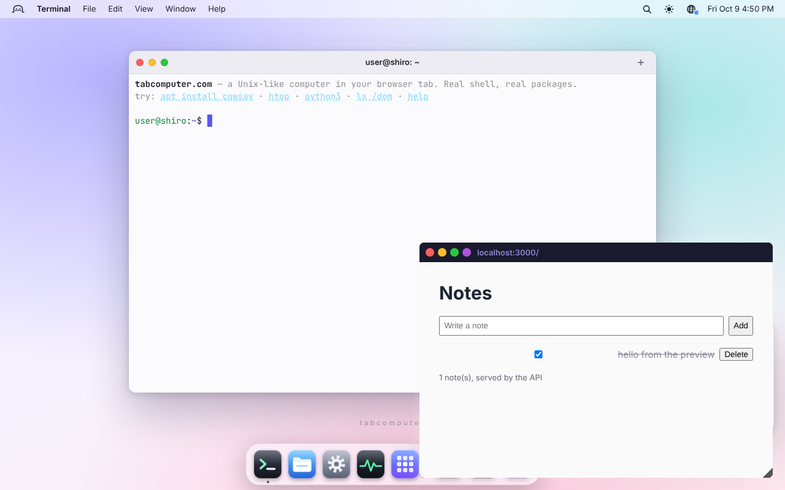

# Code sandboxes: pain points, and what tabcomputer offers

Research worker (unix/research), 2026-10-09. The question: what do people hate
about CodeSandbox, StackBlitz/WebContainers, Replit, the late Glitch, JSFiddle,
Codespaces and the rest? What could tabcomputer do that they can't? And does a
"server and client in one tab" template actually work?

**Verified** means run in tabcomputer (production, headless Chromium); **read**
means from the linked sources (fetched 2026-10-09). Reddit wasn't reachable
from the research environment, so community evidence is from HN, GitHub and
vendor forums.

## 1. 2025–2026: the free sandboxes closed

| Date | Event | Source |
|---|---|---|
| 2024-08-01 | Replit dropped Teams for Education | [The Register](https://www.theregister.com/2023/11/21/comp_sci_panic/) |
| 2024-12-12 | CodeSandbox acquired by Together AI; its SDK is now deprecated for `together-sandbox` | [Together](https://together.ai/blog/codesandbox-acquisition-together-code-interpreter) |
| **2025-07-08** | **Glitch ended project hosting** (post of 2025-05-22, re-checked) | [Glitch blog](https://blog.glitch.com/post/changes-are-coming-to-glitch/) |
| 2025-10-15 | Gitpod Classic shut down ("workspace data is no longer accessible"); renamed Ona | [Ona](https://ona.com/stories/gitpod-classic-payg-sunset) |
| 2026-03-01 | Play with Docker / Kubernetes discontinued | [Docker forum](https://forums.docker.com/t/play-with-docker-is-deprecated-and-will-be-unavailable-starting-march-1-2026-learn-about-alternatives/151177) |
| 2026-06-22 | Firebase Studio (ex-IDX): no new workspaces; data deleted 2027-03-22 | [Firebase](https://firebase.google.com/docs/studio/migrating-project) |
| 2026-07-20 | Deno Deploy Classic and its Playgrounds shut down | [Deno docs](https://docs.deno.com/deploy/classic) |
| 2026-08-28 | GitHub Classroom decommissioned, with its Codespaces classroom allowance | [GitHub #196615](https://github.com/orgs/community/discussions/196615) |
| 2026-08-31 | Trinket.io shut down | [trinket.io](https://trinket.io/) |
| Sep 2026 | **Replit has no free plan**: Core $20/mo ($18 billed annually), Pro $100/mo; re-checked | [replit.com/pricing](https://replit.com/pricing) |

Reactions:
- "Glitch helped me learn web dev 7 years ago, and also teach others" ([HN](https://news.ycombinator.com/item?id=44075317)).
- "Many great projects will be lost" ([HN](https://news.ycombinator.com/item?id=44093307)).
- On GitHub Classroom: "extremely disappointed in the lack of communication" ([#196615](https://github.com/orgs/community/discussions/196615)).
- On Codespaces quotas: "I have no idea how we are supposed to rely on this for a classroom" ([#40604](https://github.com/orgs/community/discussions/40604)).

**Why this matters for tabcomputer.** A static site that runs everything on
the client costs almost nothing per user and can be mirrored or self-hosted.
That is a structural answer to "the free tier was cut, the service shut down,
and my students' work was deleted". The answer holds only if work can be
exported and the site can't be shut down on people, which means publishing
it as open source or giving schools a clear free licence.

## 2. Comparison (October 2026)

| Product | Free tier | Runs | Backend | Real DBs | Linux binaries / apt / native addons | Offline / private | Open source | Main complaints |
|---|---|---|---|---|---|---|---|---|
| StackBlitz / WebContainers | personal, public projects; WebContainer API needs a commercial licence for for-profit production ([enterprise](https://webcontainers.io/enterprise)) | browser | Node only | no (PGlite only) | **no**: "It is not possible to run native addons" ([docs](https://developer.stackblitz.com/platform/webcontainers/troubleshooting-webcontainers)); Python is RustPython | partly | no | no raw TCP, so `pg`/Mongo drivers time out; Prisma engines fail ([#857](https://github.com/stackblitz/webcontainer-core/issues/857)); embeds need COOP/COEP on both sides; [#2100](https://github.com/stackblitz/webcontainer-core/issues/2100) embed failures (2026) |
| CodeSandbox (Together AI) | VM hours (aggregator figures; pricing page 403) | browser (front-end) + cloud VMs | yes (VM) | yes (VM) | yes (VM) | no | Sandpack only | roadmap uncertainty; one live secret per 1,299 public sandboxes ([TruffleHog 2026](https://trufflesecurity.com/blog/thousands-live-secrets-found-across-four-cloud-dev-environments)) |
| Replit | **none** | cloud | yes | hosted Postgres | yes (Nix) | no | no | bill shock ("$1K in a week", [The Register](https://www.theregister.com/2025/09/18/replit_agent3_pricing/)); blocked by school filters |
| JSFiddle / CodePen | yes | browser | **no** | no | no | no | no | front-end only |
| GitHub Codespaces | 120 core-h/month | Azure VMs | yes | yes | yes | no | no | storage billed while stopped; quota cliffs mid-semester |
| vscode.dev / github.dev | yes | browser | **no runtime** | no | no | editor only | yes | "You cannot compile, run, and debug" |
| Ona (ex-Gitpod) | $10 of usage | cloud | yes | yes | yes | no | no | Classic killed with data loss |
| Val Town | public by default | cloud (Deno) | HTTP handlers | SQLite | no | no | no | not a general Linux |
| E2B / Daytona / Modal / Vercel / Cloudflare sandboxes | credits; E2B Pro $150/mo floor | cloud microVMs | yes | yes | yes | no | E2B infra Apache-2.0; Daytona archived | per-second billing, cold starts, all cloud |
| WebVM (CheerpX) | individuals | browser (x86 JIT) | yes | possible | 32-bit x86 Debian | after load | engine proprietary; orgs incl. academia need a licence ([cheerpx.io](https://cheerpx.io/docs/licensing), re-checked) | "sluggish", networking only via Tailscale |
| **tabcomputer** | free, no account | browser | **yes: Node (fast shim) and Python (Debian), verified** | Redis from apt works (with `--maxclients 1000`); Postgres blocked on signalfd (§6) | **yes: x86-64 Debian 13, gcc, rust, go** | **yes: files stay in the browser** | (to decide) | emulation is slow for heavy CPU; no inbound ports; outbound needs the relay |

## 3. Pain points, with what solves them today

1. **Server and client in one sandbox.** "WebContainers show their limits
   pretty quickly in a full stack context" ([HN 2025-03-04](https://news.ycombinator.com/item?id=43259812)).
   An Ask HN asks for "alternatives to Glitch for hosting a simple
   Node/Express app" ([HN 2025-06-26](https://news.ycombinator.com/item?id=44383402)).
   Today's free in-browser option is StackBlitz, which is Node-only. Python
   backends need a cloud VM and an account.
2. **Real databases.** WebContainers has no raw TCP, PGlite is Postgres-only
   and single-user, and nothing in a browser runs Redis or MySQL. PGlite's
   10M weekly downloads ([electric.ax](https://electric.ax/blog/2026/06/25/pglite-reaches-10-million-weekly-downloads.md))
   show the demand for "a DB in the sandbox".
3. **Native binaries, apt, native addons.** Tailwind shipped a separate
   wasm package because "arbitrary native binaries cannot be executed in the
   browser" ([tailwindcss #13133](https://github.com/tailwindlabs/tailwindcss/issues/13133)).
4. **Ports and WebSockets.** WebContainers has in-sandbox WS but no outbound
   TCP. WebVM's networking needs a Tailscale account.
5. **Private, offline, no account.** TruffleHog found 8,792 verified live
   secrets across public sandboxes (2026). Almost everything needs an
   account, and Val Town made free code public by default.
6. **Teaching on locked machines.** See §1, and
   [OPPORTUNITIES.md](OPPORTUNITIES.md) #1.
7. **Runnable examples in docs.** TutorialKit and WebContainers embeds are
   Node-only and licensed, and need COOP/COEP on both sides. Deno's
   playgrounds are gone.

## 4. What tabcomputer can offer that the others don't

1. **"Glitch that can't be shut down."** A Node or Python backend next to
   a frontend preview, on a static, self-hostable site: no account, no
   per-user server cost. Verified below.
2. **Any language's backend**, not only Node: Python (Debian), PHP
   (`pkg install php` / `apt install php-cli`), Ruby, Go (wasip1) and
   Rust (cargo). All are in COMPAT.md.
3. **Real databases from apt.** Redis works today with one flag;
   PostgreSQL waits on signalfd (§6).
4. **Native addons and real binaries.** These are what fail on
   WebContainers. They work here, slowly.
5. **Outbound TCP without a VPN signup**, through the relay.
6. **Private by default**: files never leave the device.
7. **An agent can test its own UI** with `page :PORT click/input/text`,
   without Playwright. No cloud sandbox offers that for free. See
   [AGENT-EXPERIMENTS.md](AGENT-EXPERIMENTS.md).

**Be upfront about the weaknesses:**
- emulated CPU is 10–50× slower than native for heavy builds;
- **no inbound connections from the internet** (no webhooks, no public demo
  URL; that was Glitch's other half);
- outbound depends on the relay;
- browser storage can be evicted, and a private window's quota is ~890 MB;
- no real-time collaboration;
- it is not a hardened multi-tenant sandbox.

## 5. Prototype: fullstack-notes

[examples/fullstack-notes/](../../examples/fullstack-notes/) is a
dependency-free notes app:
- `server.js`: Node `http`, a JSON API and static files;
- `server.py`: the same API with Python's standard library;
- `public/`: an HTML and `fetch()` client;
- `test.js`: an API test (9 checks; passes on stock Node 22).

**Verified in tabcomputer** (production, headless Chromium):

| Step | Result |
|---|---|
| `node test.js` | 5 of 9 checks passed, then `assert.match is not a function`: tabcomputer's `assert` lacks it, so the test now uses `assert.ok(re.test())` |
| `node server.js 3000 &`; `serve fetch 3000 /api/health` | 200, `{"ok":true,"node":"v20.0.0","pid":1}` |
| `serve open 3000` | a desktop window titled `localhost:3000/` showing the client ("0 note(s), served by the API") |
| `page :3000 input '#text' …; page :3000 click '#save'; page :3000 text '#list'` | the note appears; `notes.json` on disk has it; the checkbox's PATCH marks it done |
| `curl -s http://localhost:3000/api/notes` from the shell | the same JSON |
| Debian `python3 server.py 3002 &` | listening after 16 s (Debian python under emulation); `serve open 3002` and `page` work the same; `notes.json` written by Python |
| WebSocket from the preview (`new WebSocket('ws://localhost:3000/ws')`) | **error** |
| EventSource from the preview (`new EventSource('/api/health')`) | **error** |
| `fs.watch` in the server's directory | **no events** (auto-reload on save impossible) |
| pkg's WASI `python3` or Pyodide `python3` as the server | can't listen: WASI preview1 has no sockets, and after `pkg install python` the prompt's `python3` was still Pyodide |

How the preview works, and why WS/SSE fail: `serve open` renders the server's
HTML into a `srcdoc` iframe and injects a script that overrides `fetch` and
`XMLHttpRequest` to post each request to the page, which asks the in-tab
virtual server (`src/iframe-server.ts`). `WebSocket` and `EventSource` aren't
overridden, so they go to the real `localhost` of the user's machine.

### Proposed fixes, in order of payoff

1. **WebSocket and EventSource in the preview.** Override them in the
   injected script the same way as fetch. A `WebSocket` shim posts
   `ws-open`/`ws-send`/`ws-close` to the page. The page opens a kernel
   connection to the guest's listening socket (`netStack` loopback already
   reaches a socket listening in the same kernel), sends the HTTP Upgrade,
   and relays frames. EventSource is a streaming fetch, which the virtual
   server can deliver as chunks. These two make Socket.IO, Vite HMR, Next
   dev, Flask-SocketIO and every "live" demo work.
2. **`fs.watch` from VFS change events** (the dock already listens to
   `fs.onChange`), later a kernel inotify for x86 and WASM guests. This makes
   nodemon, vite and `--watch` modes work.
3. **A real origin for the preview**: a Service Worker scope such as
   `/preview/PORT/` instead of `srcdoc` plus overrides. Relative URLs,
   `<form>` posts, cookies, `history.pushState` routers and module workers
   then behave as on a real host. WebContainers works this way.
4. **"Open in a browser tab"**: the same Service Worker route, opened as a
   real tab, so devtools work.
5. **Template gallery**: Express + SQLite, Flask + HTMX, PHP, static site
   with a live-reload server, each a folder like fullstack-notes, plus a
   "New project from template" in Files.
6. **Export and import**: download a project as a zip or git bundle, and
   import Glitch, Replit and Trinket zips. Durability is the first question
   people ask about a browser sandbox.

## 6. Databases (status)

| Server | Result (verified) |
|---|---|
| **Redis 8.0.2** (`sudo apt install redis-server`, 131 s) | ✅ **with `--maxclients 1000`**: `redis-server --bind 127.0.0.1 --maxclients 1000 &`, then `redis-cli ping` PONG (1.2 s), SET/GET/INCR correct. Without it Redis aborts ("Guru Meditation: aeApiPoll: epoll_wait, Invalid argument"): Blink rejects `epoll_wait` maxevents > 4096 (patch 0011), and Redis asks for maxclients+128. `redis-benchmark` crashes the same way. Before the argv[0] fix, `redis-server` ran as `redis-check-rdb`; the default `bind * -::*` also fails (IPv6 wildcard after IPv4 is EADDRINUSE), hence `--bind 127.0.0.1` |
| **PostgreSQL 17** (`sudo apt install postgresql`, 12 min) | ❌ **blocked**. `initdb` (run as the normal user) fails in bootstrap with "FATAL: signalfd() failed", as does `postgres`. The package's own cluster creation also fails earlier: "su: cannot open session: Permission denied", "Could not change user id". Until signalfd exists, use the builtin `psql` (PGlite, `src/commands/postgres.ts`) for Postgres lessons |
| SQLite | ✅ `pkg install sqlite` (COMPAT.md), and Python's `sqlite3` module |

All three are reported to the coordinator. With signalfd, an epoll maxevents
clamp and working `su`, "a real Postgres and Redis next to your app, in a
tab, offline" becomes a headline no other in-browser sandbox can claim.
